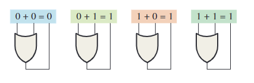
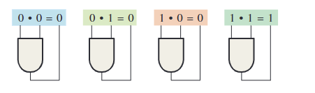
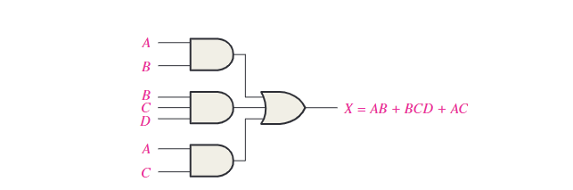
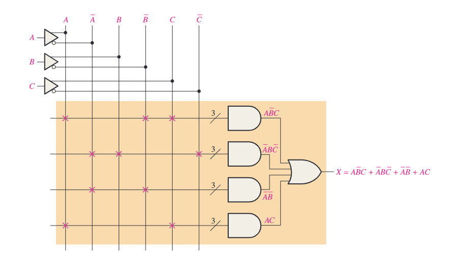
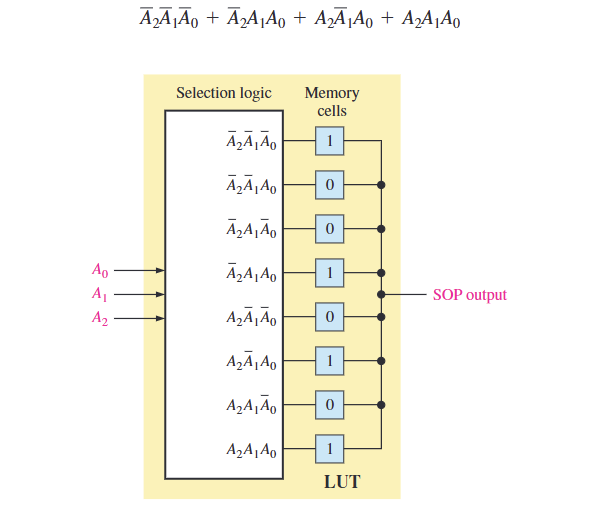
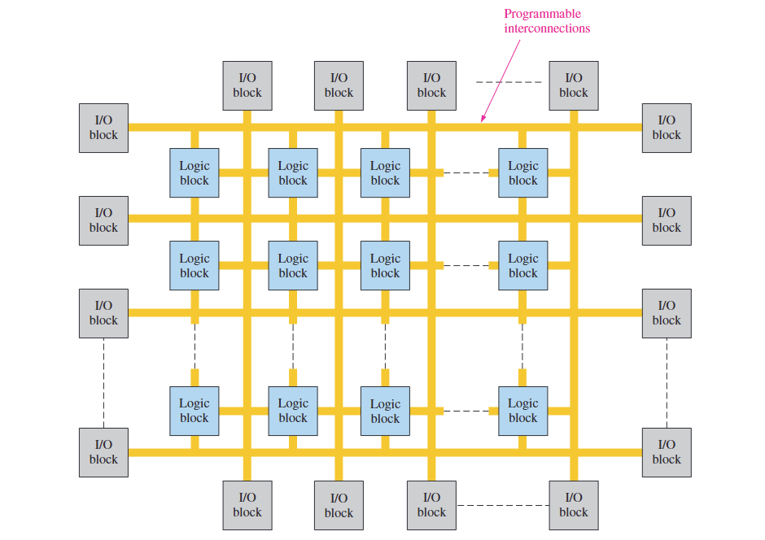

 For some reason, there exists an implicit hierarchy of disdain in embedded development: those working on 8051 microcontrollers tend to look down on basic circuit developers, STM32 developers look down on those working with 8051, and FPGA developers look down on STM32 developers. Today, our main focus is on FPGA!

## What is FPGA?

  A Field Programmable Gate Array(FPGA) is a type of configurable integrated circuit which can be repeatedly programmed after manufacturing.

  Many customers favor FPGA over MCU for its programmability and flexibility for the fact that customers could customize their own circuits based on their needs. In addition, FPGA boast higher performance because of its parallel structure, meaning they can process data in a given clock than  MCU does. Consequently, FPGA chips are more expensive than MCUs.

## How it works

- **Boolean Algebra**

  

     In logic, we often use ***true (1)*** or ***false (0)*** to judge whether an event occurs. For example, we use a variable **A** to denote whether it will rain tomorrow. If it rains, **A** equals 1, which means the event occurs; otherwise, **A** equals 0.

  This logic is analogous to the use of **high (1)** and **low (0)** voltage levels in circuits to detect specific events and enable the circuit to respond accordingly.

  To perform these logical operations, circuits rely on **logic gates**. The equivalent Boolean operations of logic gates are as follows:

  - **Or Gate**: Performs Boolean addition
  - **And Gate**: Performs Boolean multiplication

  Or gate:

  

  And Gate:

  

- **Sum of Products**

  Essentially, **Or Gates (Boolean addition)** and **And Gates (Boolean multiplication)** can be combined to detect multiple events. This is represented in the **Sum of Products** form, where a function is expressed as a series of **AND operations (products)** combined through **OR operations (summation)**. For example:  
  `F = (A AND B) OR (B AND C AND D) OR(A AND C)`.

  Ideally, as long as there are sufficient resources, we can design circuits to represent the world in terms of 0s and 1s. This is the fundamental concept behind how computers work.

  

  

  

  

  

- **Truth Table**

  A Truth Table is a tabular representation of all possible input combinations and their corresponding outputs for a logic circuit or function. It is used to understand and verify the behavior of the circuit.

  For example, consider a simple AND gate with two inputs, **A** and **B**, and one output, **F**. The truth table would look like this:

  | **A** | **B** | **F (A AND B)** |
  | ----- | ----- | --------------- |
  | 0     | 0     | 0               |
  | 0     | 1     | 0               |
  | 1     | 0     | 0               |
  | 1     | 1     | 1               |

  The Truth Table not only helps in analyzing individual gates but also serves as a blueprint for designing and validating more complex functions implemented within an FPGA. When circuits become large and complex, tools like LUTs are used to handle these truth table mappings efficiently.
  
  

- **Lookup Tables (LUTs)**

    Lookup Tables (LUTs) are a direct hardware implementation of truth tables in an FPGA. They are small memory units that store the output values for all possible input combinations of a logic function. This means an LUT essentially maps the truth table into a programmable circuit.

  For example, consider the same AND gate as above. The LUT for this gate would store the output column of the truth table:

  | **Address (Input Combination)** | **Stored Value (Output)** |
  | ------------------------------- | ------------------------- |
  | 00                              | 0                         |
  | 01                              | 0                         |
  | 10                              | 0                         |
  | 11                              | 1                         |

  Here:
  - The **address** corresponds to the input combination (e.g., A = 0, B = 1 corresponds to 01 in binary).
  - The **stored value** represents the corresponding output for that combination.

  The relationship between the truth table and LUTs allows FPGAs to implement logic functions efficiently:
  - **Truth Table as the Blueprint**: The truth table defines the desired behavior of the logic circuit.
  - **LUT as the Hardware Realization**: The LUT translates this behavior into a physical implementation by storing the outputs for all possible inputs.

  By leveraging LUTs, FPGAs can dynamically reprogram their hardware to implement a wide variety of functions, making them highly versatile. For larger designs, multiple LUTs are interconnected through the FPGA’s programmable interconnects, enabling the implementation of complex logic circuits without the need for custom hardware.

- **Interconnects**

  Interconnects are the backbone of an FPGA's programmable wiring network. They connect Lookup Tables (LUTs), registers, and other logic elements, allowing the FPGA to form custom circuits based on the user’s design. Without interconnects, the individual LUTs would remain isolated and unable to contribute to a larger, functional design.

  ### Relationship Between Interconnects and LUTs

  While LUTs implement the logic of individual truth tables, interconnects are responsible for connecting the outputs of one LUT to the inputs of another. This connectivity enables the FPGA to scale simple logic operations into complex systems.

  For example:
  - A single LUT might implement a basic logic function like `A AND B`.
  - Through interconnects, the output of this LUT could be routed as an input to another LUT that performs a function like `(A AND B) OR C`.

  

  The interconnect system in an FPGA consists of several programmable elements that allow signals to traverse the chip:
  1. **Global Routing Resources**: These are long wires that span across large areas of the FPGA, enabling signals to travel between distant parts of the chip.
  2. **Switch Matrices**: These are grids of programmable switches that control how signals move between different routing paths. Users configure these switches to create the connections needed for their design.
  3. **Local Routing Resources**: Short wires are used to connect nearby logic elements, such as linking one LUT to a neighboring LUT.
  4. **Dedicated Lines**: For high-speed or specialized connections, dedicated lines provide direct, efficient pathways that bypass general-purpose routing.

  
