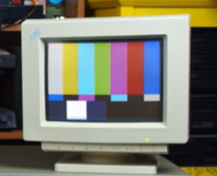
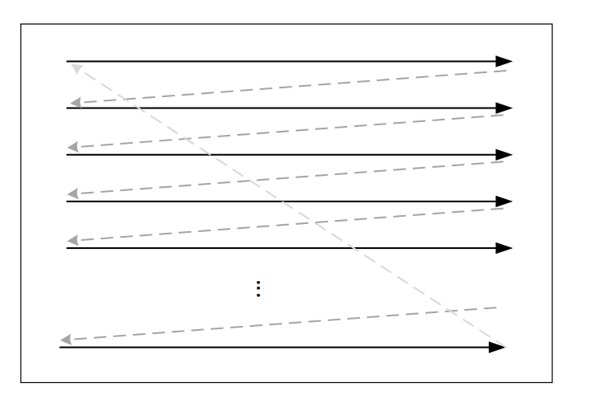
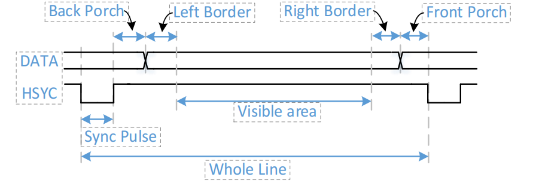
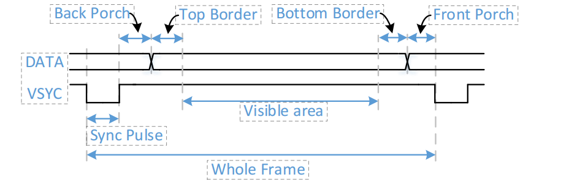
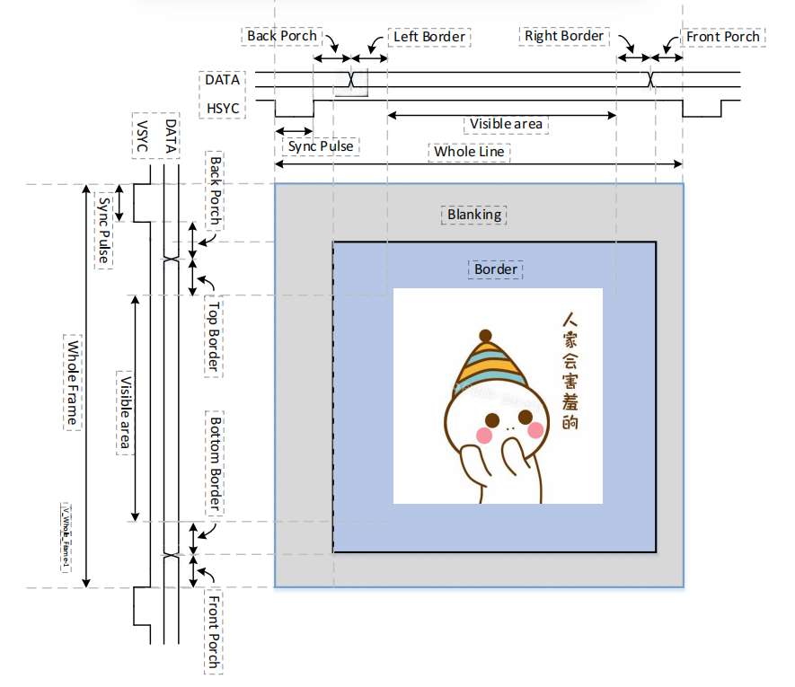
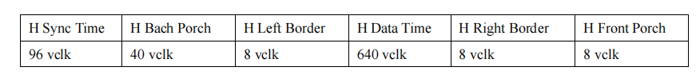
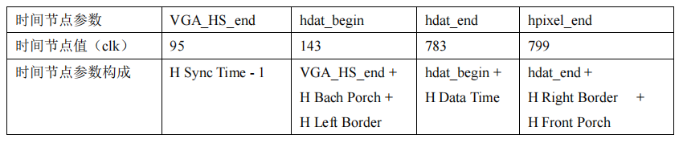
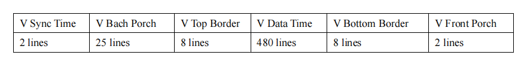
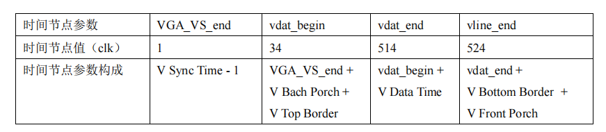

#  VGA

## What is VGA?

   **Video Graphics Array (VGA)** is the bridge between a computer and a monitor, enabling them to communicate seamlessly and display vibrant visuals.



​    **VGA** is an **analog signal** video connection standard, introduced in 1987. Much like the energy of 80s rock music, it brought new possibilities to technology at the time. It uses a familiar "blue-head" cable to transmit image signals from a computer to a monitor, relying on **RGB (Red, Green, Blue)** and **sync signals** to display images


## How VGA Works

- **Color Signal Transmission:** The computer sends varying intensities of electric signals for red, green, and blue, which cause electrons to strike the screen, creating colors.

- **Sync Signals:** Similar to following rows and columns when painting, VGA uses **horizontal sync (H-Sync)** and **vertical sync (V-Sync)** signals to ensure images are displayed accurately without distortion.

- **Progressive Scanning:** VGA scans the screen line by line, like painting with a roller, **from left to right, top to bottom**.

  

  

##  VGA Timing

### Operating Process

  VGA timing defines the rhythm of "drawing" images on a screen. Think of it as a **strict queuing mechanism** that ensures each pixel is displayed in order without causing visual chaos. It primarily includes:

- **Horizontal Timing (H-Sync):** The process of rendering each row on the screen is like writing a line of text:

  1. **Display Area:** The active area where VGA draws visible pixels (Phase C).
  2. **Front Porch:** A brief pause after completing a row, preparing for the next.
  3. **Sync Pulse:** A trigger signal telling the monitor to switch to the next line.
  4. **Back Porch:** Ensures stable synchronization before starting a new row.

  Together, these phases constitute a **complete row timing**.



- **Vertical Timing (V-Sync):** Similar to the concept of "line breaks," it controls the screen refresh cycle, ensuring each frame updates orderly:

  1. **Display Area:** The section where the visible screen area is drawn.
  2. **Front Porch:** A buffer before starting a new frame.
  3. **Sync Pulse:** A trigger to begin a new frame.
  4. **Back Porch:** A stabilization phase to ensure smooth transitions between frames.
  
  

When VGA draws a frame, it follows these steps:

1. Scans line by line, displaying each row according to the horizontal timing.
2. Synchronizes and moves to the next row after finishing one.
3. After completing all rows, enters vertical synchronization to prepare for the next frame.

VGA timing is a rhythmic system for pixel transfer, ensuring images are displayed orderly, **like a symphony where missing a beat would cause chaos!**



 **Note:** Here, horizontal and vertical sync signals are assumed to be low-level active; otherwise, they are high-level.


### Pixel Clock

The pixel clock acts as the metronome of the entire process, determining how many pixels are processed per second. The higher the pixel clock frequency, the higher the resolution and refresh rate. For example:

- **640x480 @ 60Hz** → 25.175 MHz
- **800x600 @ 60Hz** → 40 MHz
- **1024x768 @ 60Hz** → 65 MHz


## VGA Design

To summarize, our goal is to design a **VGA display controller** whose primary responsibilities are:

1. **Generating Sync Signals** to ensure proper image display.
   - **Horizontal Sync Signal (HSYNC):** Controls the scanning of each row.
   - **Vertical Sync Signal (VSYNC):** Controls the refresh of the entire screen.
2. **Outputting Image Data** at the correct time to provide pixel information.


### **Design Concept**

​     The VGA display process can be broken into **horizontal scanning** and **vertical scanning**, both sharing a similar core concept but differing in execution:

- **Horizontal Scanning:** Timed by the pixel clock, it completes the display of a single row.
- **Vertical Scanning:** Timed by the row counter, it refreshes the entire screen.

We use **two counters** to manage timing control:

1. **Horizontal Counter** (driven by the pixel clock, counts 800 cycles, controls HSYNC).
2. **Vertical Counter** (driven by horizontal counter overflow, counts 525 rows, controls VSYNC).

### **Horizontal Scanning Timing Design**（e.g., 640×480@60Hz）

Each row scan consists of 800 clock cycles, divided into phases:

1. **H Sync Time:** Pulls HSYNC low, sends sync pulses, and turns the screen black.
2. **H Back Porch:** Keeps HSYNC high, maintains black screen, and waits for stabilization.
3. **H Left Border:** Prepares the screen for display, maintaining high-level signals.
4. **H Data Time:** Sends actual pixel data, keeping HSYNC high.
5. **H Right Border:** Ends the display, stopping data output.
6. **H Front Porch:** A short pause before moving to the next row, keeping the screen black.

**After one row is completed, the counter resets, moving to the next row.**

### **Vertical Scanning Timing Design**

A full frame consists of 525 rows, divided into phases:

1. **V Sync Time:** Pulls VSYNC low, marking the start of a new frame.
2. **V Back Porch:** Waits for stabilization, keeping the screen black.
3. **V Data Time:** Begins rendering the complete image line by line.
4. **V Right Border:** Leaves blank spaces on the screen, stopping data output.
5. **V Front Porch:** A short pause before transitioning to the next frame.

**When the vertical counter reaches 525 rows, it resets for the next frame.**

### **Core Logic Implementation**

1. **Horizontal Counter (Horizontal Scanning):**
   - Clock: Pixel clock (25.175 MHz).
   - Count range: 0–799 (800 clock cycles).
   - At different count values, it controls HSYNC signals and data output.

 

**Note:** The parameters in the table are established by the Video Electronics Standards Association (VESA).





2. **Field_Counter（Vertical Scan）**：

- Driven by row counter overflow, increasing by +1 for each row.
- Counting range: 0-524 (525 lines).
- Controls the VSYNC signal and data output at different count values.





### Summary

- **Row Scan**: Outputs data pixel by pixel, and after completing one row, the field scan increases by +1.
- **Field Scan**: Displays data row by row, and after completing the entire screen, moves to the next frame.
- **Two-level counters control sync signals**, ensuring the correct timing to output image data and achieve stable 640x480 resolution on the display.

This approach enables precise VGA display control, allowing stable output of 640x480 resolution images.


##  代码

1. VGA 控制模块

`````` verilog
module Vga_Ctrl(
    // Inputs
    input clk_25M,     // 25MHz clock input
    input rst_n,      // Reset signal, active low
    input [23:0]data_in, // 24-bit RGB data input

    // Outputs
    output [9:0]hcount,    // Horizontal counter output
    output [9:0]vcount,    // Vertical counter output
    output [23:0] VGA_RGB,  // 24-bit RGB data output
    output VGA_HS,     // Horizontal sync signal
    output VGA_VS,     // Vertical sync signal
    output VGA_BLK,    // Blanking signal
    output VGA_CLK      // VGA pixel clock
    );

    // Invert and output the clock signal for DAC data storage (related to the specific project)
    assign VGA_CLK = ~clk_25M;

    // Registers
    reg [9:0]hcount_r;  // Horizontal counter register
    reg [9:0]vcount_r;  // Vertical counter register

    // Wires
    wire hcount_ov;     // Horizontal counter overflow signal
    wire vcount_ov;     // Vertical counter overflow signal
    wire dat_act;       // Data active region flag

    // Timing parameter table (640x480 @ 60Hz)
    parameter 
        VGS_HS_End = 95,     // Horizontal sync signal end position
        Hdata_Begin = 143,   // Horizontal active data start position
        Hdata_End = 783,    // Horizontal active data end position
        Hpixel_End = 799,    // Horizontal scan end position

        VGS_VS_End = 1,      // Vertical sync signal end position
        Vdata_Begin = 34,    // Vertical active data start position
        Vdata_End = 514,     // Vertical active data end position
        Vline_End = 524;     // Vertical scan end position

    // Horizontal counter
    always @(posedge clk_25M or negedge rst_n) begin
        if (!rst_n)          // Reset: Clear horizontal counter
            hcount_r <= 10'd0;
        else if (hcount_r == Hpixel_End)  // When horizontal scan ends: Clear counter
            hcount_r <= 10'd0;
        else                // Otherwise: Increment counter
            hcount_r <= hcount_r + 10'd1;
    end

    // Horizontal counter overflow signal
    assign hcount_ov = (hcount_r == Hpixel_End);  // Overflow when counter reaches max

    // Vertical counter
    always @(posedge clk_25M or negedge rst_n) begin
        if (!rst_n)          // Reset: Clear vertical counter
            vcount_r <= 10'd0;
        else if (hcount_ov) begin  // On horizontal counter overflow: Increment vertical counter
            if (vcount_r == Vline_End)  // When vertical scan ends: Clear counter
                vcount_r <= 10'd0;
            else                // Otherwise: Increment counter
                vcount_r <= vcount_r + 10'd1;
        end
    end

    // Vertical counter overflow signal
    assign vcount_ov = (vcount_r == Vline_End) & hcount_ov;  // Overflow on both counters reaching max

    // Output horizontal and vertical counters
    assign hcount = hcount_r;
    assign vcount = vcount_r;

    // Horizontal sync signal (active low)
    assign VGA_HS = (hcount_r >= VGS_HS_End) ? 1'b1 : 1'b0;  // Sync active when count >= VGS_HS_End

    // Vertical sync signal (active low)
    assign VGA_VS = (vcount_r >= VGS_VS_End) ? 1'b1 : 1'b0;  // Sync active when count >= VGS_VS_End

    // Data active region flag
    assign dat_act = (hcount_r >= Hdata_Begin) && (hcount_r <= Hdata_End) && 
                     (vcount_r >= Vdata_Begin) && (vcount_r <= Vdata_End);  // Active within data range

    // VGA_RGB output
    assign VGA_RGB = (dat_act == 1'b1) ? data_in : 24'd0;  // Output RGB data in active region, else black

    // VGA_BLK output (blanking)
    assign VGA_BLK = ~dat_act;   // High during blanking for screen blanking

endmodule

``````


2 .VGA 测试模块

`````` verilog
module Vga_Ctrl_Test(
  input clk_50M,      // 50MHz clock input
  input rst_n,       // Reset signal, active low
  output [23:0] VGA_RGB, // 24-bit RGB data output
  output VGA_HS,      // Horizontal sync signal
  output VGA_VS,      // Vertical sync signal
  output VGA_BLK,     // Blanking signal
  output VGA_CLK      // VGA pixel clock
);

  reg [23:0] disp_data; // Display data register
  wire [9:0] hcount;    // Horizontal counter
  wire [9:0] vcount;    // Vertical counter
  wire clk_25M;       // 25MHz clock

  // Call clock IP core to divide 50MHz clock to 25MHz
  clk_wiz_0 clk_div2 (
     .clk_out1(clk_25M),     // output clk_out1
     .resetn(rst_n), // input resetn
    .clk_in1(clk_50M)      // input clk_in1
);  


// Instantiate VGA controller module
  Vga_Ctrl vga_ctrl (
    .clk_25M(clk_25M),  // 25MHz clock input
    .rst_n(rst_n),     // Reset signal
    .data_in(disp_data), // RGB data input
    .hcount(hcount),    // Horizontal counter output
    .vcount(vcount),    // Vertical counter output
    .VGA_RGB(VGA_RGB),  // RGB data output
    .VGA_HS(VGA_HS),    // Horizontal sync signal output
    .VGA_VS(VGA_VS),    // Vertical sync signal output
    .VGA_BLK(VGA_BLK),   // Blanking signal output
    .VGA_CLK(VGA_CLK)   // VGA pixel clock output
  );


  // Define color codes
  localparam 
    BLACK   = 24'h000000, // Black
    BLUE    = 24'h0000FF, // Blue
    RED     = 24'hFF0000, // Red
    PURPPLE = 24'hFF00FF, // Purple
    GREEN   = 24'h00FF00, // Green
    CYAN    = 24'h00FFFF, // Cyan
    YELLOW  = 24'hFFFF00, // Yellow
    WHITE   = 24'hFFFFFF; // White

  // Define color values for each pixel block
  localparam 
    R0_C0 = BLACK,   // Row 0, Column 0 pixel block
    R0_C1 = BLUE,    // Row 0, Column 1 pixel block
    R1_C0 = RED,     // Row 1, Column 0 pixel block
    R1_C1 = PURPPLE, // Row 1, Column 1 pixel block
    R2_C0 = GREEN,   // Row 2, Column 0 pixel block
    R2_C1 = CYAN,    // Row 2, Column 1 pixel block
    R3_C0 = YELLOW,  // Row 3, Column 0 pixel block
    R3_C1 = WHITE;   // Row 3, Column 1 pixel block

  // Define row and column boundaries using parameters
  localparam ROW_HEIGHT = 120;  // Height of each row
  localparam COL_WIDTH  = 320;  // Width of each column

  // Generate active signals for rows and columns using for-loops
  wire [3:0] row_act;
  wire [1:0] col_act;
  genvar i, j;
  generate
    for (i = 0; i < 4; i = i + 1) begin : gen_row_act
      assign row_act[i] = (vcount >= i * ROW_HEIGHT) && (vcount < (i + 1) * ROW_HEIGHT);
    end
    for (j = 0; j < 2; j = j + 1) begin : gen_col_act
      assign col_act[j] = (hcount >= j * COL_WIDTH) && (hcount < (j + 1) * COL_WIDTH);
    end
  endgenerate

  // Use a case statement to select color based on active row and column signals
  always @(*) begin
    case ({row_act, col_act})
        8'b0001_00: disp_data = R0_C0; // Row 0, Column 0
        8'b0001_01: disp_data = R0_C1; // Row 0, Column 1
        8'b0010_00: disp_data = R1_C0; // Row 1, Column 0
        8'b0010_01: disp_data = R1_C1; // Row 1, Column 1
        8'b0100_00: disp_data = R2_C0; // Row 2, Column 0
        8'b0100_01: disp_data = R2_C1; // Row 2, Column 1
        8'b1000_00: disp_data = R3_C0; // Row 3, Column 0
        8'b1000_01: disp_data = R3_C1; // Row 3, Column 1
      default:    disp_data = BLACK; // Default to black 
    endcase
  end

endmodule

``````


3. 仿真测试代码

   ``````verilog
   // Simulation Test Code
   `timescale 1ns / 1ps
   
   `define clk_period 40
   
   module Vga_Ctrl_TB();
     // Inputs
     reg clk_25M;       // 25MHz clock input
     reg rst_n;        // Reset signal, active low
     reg [23:0] data_in; // 24-bit RGB data input
   
     // Outputs
     wire [9:0] hcount;    // Horizontal count output
     wire [9:0] vcount;    // Vertical count output
     wire [23:0] VGA_RGB;  // 24-bit RGB data output
     wire VGA_HS;      // Horizontal sync signal output
     wire VGA_VS;      // Vertical sync signal output
     wire VGA_CLK;     // VGA pixel clock output
     wire VGA_BLK;     // Blanking signal output
   
     // Line scan count counter
     reg [11:0] v_cnt = 0; 
   
     // Instantiate the VGA controller module
     Vga_Ctrl vga_ctrl (
       .clk_25M(clk_25M),  // 25MHz clock input
       .rst_n(rst_n),     // Reset signal
       .data_in(data_in), // RGB data input
       .hcount(hcount),    // Horizontal count output
       .vcount(vcount),    // Vertical count output
       .VGA_RGB(VGA_RGB),  // RGB data output
       .VGA_HS(VGA_HS),    // Horizontal sync signal output
       .VGA_VS(VGA_VS),    // Vertical sync signal output
       .VGA_BLK(VGA_BLK),   // Blanking signal output
       .VGA_CLK(VGA_CLK)   // VGA pixel clock output
     );
   
     // Initialization
     initial begin
       clk_25M = 0;
       rst_n = 0;
       data_in = 24'd0; 
       #(`clk_period * 20 + 1); // Reset duration
       rst_n = 1;
       data_in = 24'hfff_fff; // Set display color to white
     end
   
     // 25MHz clock generation
     always #(`clk_period / 2) clk_25M = ~clk_25M;
   
     // Line scan count
     always @(posedge VGA_VS) begin // Count on the rising edge of the vertical sync signal
       v_cnt <= v_cnt + 12'd1;
     end
   
     // Display output
     initial begin
       $monitor("time=%t, hcount=%d, vcount=%d, VGA_RGB=%h, VGA_HS=%b, VGA_VS=%b, VGA_BLK=%b", 
                $time, hcount, vcount, VGA_RGB, VGA_HS, VGA_VS, VGA_BLK);
     end
   
   endmodule
   
   ``````
   
   

