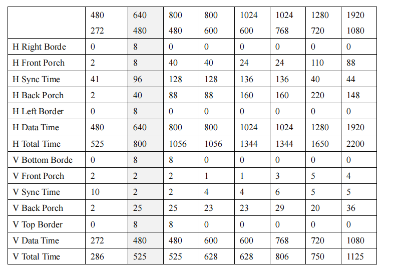

# Conditional Compilation: Your Hero That Saves the Day!

​    In my last post, we explored how VGA works and how to design a basic VGA controller for a specific resolution. But, guess what? Your VGA might not follow the same resolution standards. In fact, it could be a whole different ball game! Check out the table below to see how things vary.




If your code and design aren’t parameterized—especially if you plan on selling your product to clients—you might want to consider flipping your code upside down. But hey, don’t panic—this little hiccup is totally avoidable! **Conditional compilation** can save you from a world of headaches.

As we’ve learned from the article below, the timing expressions are fixed, and they look like this:

``````verilog
Hdata_Begin = H_Sync_Time + H_Back_Porch + H_Left_Border -1;
Hdata_End   = H_Total_Time - H_Right_Border - H_Front_Porch -1;
Vdata_Begin = V_Sync_Time + V_Back_Porch + V_Top_Border -1;
Vdata_End   = V_Total_Time -V_Bottom_Border - V_Front_Porch -1;

VGA_HS_End = H_Sync_Time  -1;
VGA_VS_End = V_Sync_Time  -1;
Hpixel_End = H_Total_Time -1;
Vline_End  = V_Total_Time -1; 
``````

It totally makes sense, right? We can leverage what we've got by feeding the correct values into the parameters on the right side of the equation.

But before we dive into the details, let’s take a quick look at a 16-bit clock. It'll give you a solid feel for how conditional compilation really works in practice.

``````verilog
`define Case_A
//`define Case_B

`ifdef Case_A
	`define CNT_MAX 2000
`elseif Case_B
	`define CNT_MAX 2500
`else `define CNT_MAX 1000
`endif

always@(posedge clk or negedge rst_n)begin
    if(!rst_n)begin 
        cnt<=0;
    end else if(cnt==`CNT_MAX)begin
        cnt<=0;
    end else begin
        cnt<=cnt+1;
    end//else
end


``````

Pretty simple, right? For a savvy designer like you, this should be a walk in the park, isn’t it?

Now, with the **table we saw earlier** in hand, we're ready to weaponize conditional compilation and take down those tedious monsters once and for all!

``````verilog

// Enable predefined settings based on the actual resolution used, and comment out others

//`define Resolution_480x272   // clock frq  9MHz
`define Resolution_640x480     // clock frq  25.175MHz
//`define Resolution_800x480   // clock frq  33MHz
//`define Resolution_800x600   // clock frq  40MHz
//`define Resolution_1024x768  //clock frq  65MHz
//`define Resolution_1280x720  //clock frq 74.25MHz
//`define Resolution_1920x1080 // clock frq 148.5MHz


// Define the timing parameters
`ifdef Resolution_480x272
    `define H_Total_Time         525
    `define H_Right_Border       0
    `define H_Front_Porch        2
    `define H_Sync_Time          41
    `define H_Back_Porch         2
    `define H_Left_Border        0

    `define V_Total_Time         286
    `define V_Bottom_Border      0
    `define V_Front_Porch        2
    `define V_Sync_Time          10
    `define V_Back_Porch         2
    `define V_Top_Border         0

`elsif Resolution_640x480
    `define H_Total_Time         800
    `define H_Right_Border       8
    `define H_Front_Porch        8
    `define H_Sync_Time          96
    `define H_Back_Porch         40
    `define H_Left_Border        8

    `define V_Total_Time         525
    `define V_Bottom_Border      8
    `define V_Front_Porch        2
    `define V_Sync_Time          2
    `define V_Back_Porch         25
    `define V_Top_Border         8

`elsif Resolution_800x480
    `define H_Total_Time         1056
    `define H_Right_Border       0
    `define H_Front_Porch        40
    `define H_Sync_Time          128
    `define H_Back_Porch         88
    `define H_Left_Border        0

    `define V_Total_Time         525
    `define V_Bottom_Border      8
    `define V_Front_Porch        2
    `define V_Sync_Time          2
    `define V_Back_Porch         25
    `define V_Top_Border         8

`elsif Resolution_800x600
    `define H_Total_Time         1056
    `define H_Right_Border       0
    `define H_Front_Porch        40
    `define H_Sync_Time          128
    `define H_Back_Porch         88
    `define H_Left_Border        0

    `define V_Total_Time         628
    `define V_Bottom_Border      0
    `define V_Front_Porch        1
    `define V_Sync_Time          4
    `define V_Back_Porch         23
    `define V_Top_Border         0

`elsif Resolution_1024x768
    `define H_Total_Time         1344
    `define H_Right_Border       0
    `define H_Front_Porch        24
    `define H_Sync_Time          136
    `define H_Back_Porch         160
    `define H_Left_Border        0

    `define V_Total_Time         806
    `define V_Bottom_Border      0
    `define V_Front_Porch        3
    `define V_Sync_Time          6
    `define V_Back_Porch         29
    `define V_Top_Border         0

`elsif Resolution_1280x720
    `define H_Total_Time         1650
    `define H_Right_Border       0
    `define H_Front_Porch        110
    `define H_Sync_Time          40
    `define H_Back_Porch         220
    `define H_Left_Border        0

    `define V_Total_Time         750
    `define V_Bottom_Border      0
    `define V_Front_Porch        5
    `define V_Sync_Time          5
    `define V_Back_Porch         20
    `define V_Top_Border         0

`elsif Resolution_1920x1080
    `define H_Total_Time         2200
    `define H_Right_Border       0
    `define H_Front_Porch        88
    `define H_Sync_Time          44
    `define H_Back_Porch         148
    `define H_Left_Border        0

    `define V_Total_Time         1125
    `define V_Bottom_Border      0
    `define V_Front_Porch        4
    `define V_Sync_Time          5
    `define V_Back_Porch         36
    `define V_Top_Border         0

`endif


``````


After conquering the predefined mountain, we’ll cruise down the hill with just a minor tweak to our code.

```````verilog
`include "VGA_Config.vh"

module Vga_Ctrl(
    // Inputs
    input clk_25M,       // 25MHz clock input
    input rst_n,         // Reset signal, active low
    input [23:0]data_in, // 24-bit RGB data input

    // Outputs
    output [9:0]hcount,   // Horizontal counter output
    output [9:0]vcount,   // Vertical counter output
    output [23:0] VGA_RGB, // 24-bit RGB data output
    output VGA_HS,        // Horizontal synchronization signal
    output VGA_VS,        // Vertical synchronization signal
    output VGA_BLK,       // Blanking signal
    output VGA_CLK        // VGA pixel clock
    );

    // Invert the output clock signal, used as the DAC data latch signal (related to the specific project)
    assign VGA_CLK=~clk_25M;

    // Registers
    reg [9:0]hcount_r;    // Horizontal counter register
    reg [9:0]vcount_r;    // Vertical counter register

    // Wires
    wire hcount_ov;       // Horizontal counter overflow signal
    wire vcount_ov;       // Vertical counter overflow signal
    wire dat_act;         // Data active area flag


    // Timing parameters (640x480 @ 60Hz)
    parameter
        Hdata_Begin =  `H_Sync_Time +`H_Back_Porch +`H_Left_Border -1  ,    // Start position of horizontal active data
        Hdata_End   =  `H_Total_Time - `H_Right_Border -`H_Front_Porch - 1 , // End position of horizontal active data
        Vdata_Begin =  `V_Sync_Time + `V_Back_Porch +`V_Top_Border -1 ,    // Start position of vertical active data
        Vdata_End   =  `V_Total_Time - `V_Bottom_Border -`V_Front_Porch -1,  // End position of vertical active data

        VGA_HS_End  = `H_Sync_Time  -1,
        VGA_VS_End  = `V_Sync_Time  -1,
        Hpixel_End  = `H_Total_Time -1,
        Vline_End   = `V_Total_Time -1;


    // Horizontal counter
    always @(posedge clk_25M or negedge rst_n) begin
        if(!rst_n)                 // When reset, the horizontal counter is cleared
            hcount_r <= 10'd0;
        else if (hcount_r == Hpixel_End) // When the horizontal scan end position is reached, the horizontal counter is cleared
            hcount_r <= 10'd0;
        else                       // Otherwise, the horizontal counter increments by 1
            hcount_r <= hcount_r + 10'd1;
    end

    // Horizontal counter overflow signal
    assign hcount_ov = (hcount_r == Hpixel_End); // When the horizontal counter reaches the maximum value, the overflow signal is active

    // Vertical counter
    always @(posedge clk_25M or negedge rst_n) begin
        if(!rst_n)                 // When reset, the vertical counter is cleared
            vcount_r <= 10'd0;
        else if(hcount_ov) begin   // When the horizontal counter overflows, the vertical counter increments
            if(vcount_r == Vline_End) // When the vertical scan end position is reached, the vertical counter is cleared
                vcount_r <= 10'd0;
            else                       // Otherwise, the vertical counter increments by 1
                vcount_r <= vcount_r + 10'd1;
        end
    end

    // Vertical counter overflow signal
    assign vcount_ov = (vcount_r == Vline_End) & hcount_ov; // When the vertical counter reaches the maximum value and the horizontal counter overflows, the overflow signal is active

    // Output horizontal and vertical counts
    assign hcount = hcount_r;
    assign vcount = vcount_r;

    // Horizontal synchronization signal (active low)
    assign VGA_HS = (hcount_r >= VGA_HS_End) ? 1'b1 : 1'b0; // When the horizontal counter is greater than or equal to VGS_HS_End, the horizontal synchronization signal is active

    // Vertical synchronization signal (active low)
    assign VGA_VS = (vcount_r >= VGA_VS_End) ? 1'b1 : 1'b0; // When the vertical counter is greater than or equal to VGS_VS_End, the vertical synchronization signal is active

    // Data active area flag
    assign dat_act = (hcount_r >= Hdata_Begin) && (hcount_r <= Hdata_End) &&
                     (vcount_r >= Vdata_Begin) && (vcount_r <= Vdata_End); // When both horizontal and vertical counters are within the active data area, the data active area flag is active

    // VGA_RGB output
    assign VGA_RGB = (dat_act == 1'b1) ? data_in : 24'd0; // Output RGB data in the active data area, otherwise output black

    // VGA_BLK output (blanking)
    assign VGA_BLK = ~dat_act;   // Output high in the data active area, used for screen blanking

endmodule
```````

Pretty cool, right? Now that I’ve handed the power of conditional compilation over to you, I’m counting on you to master it and save yourself from future headaches!
