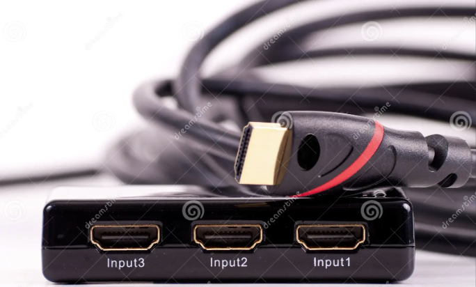
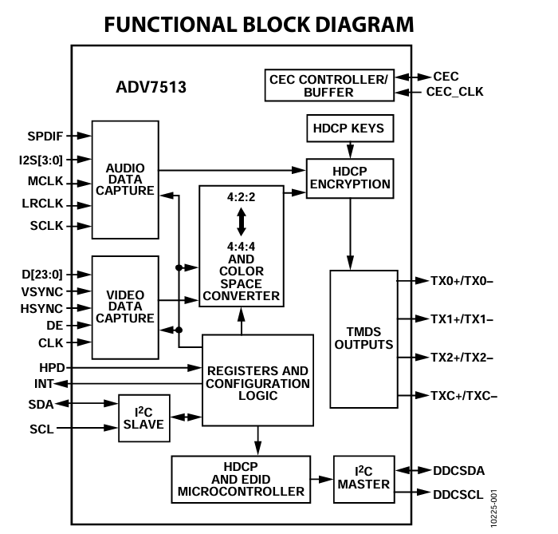
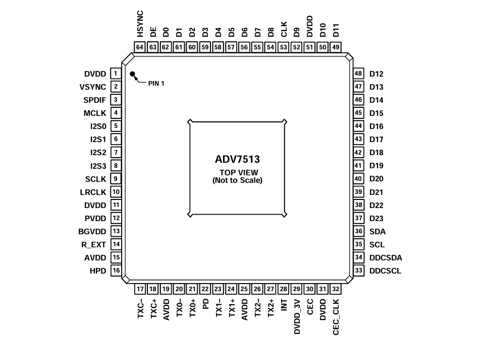
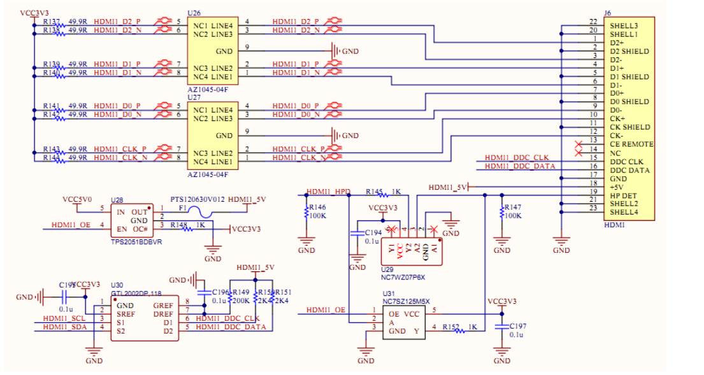
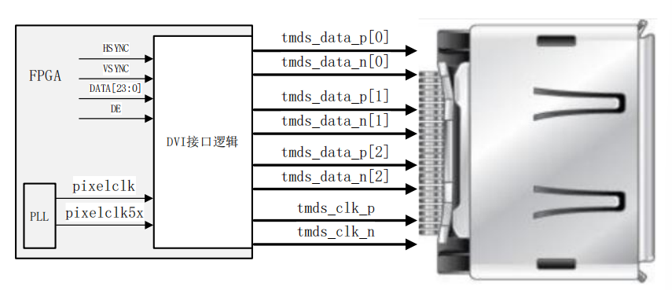
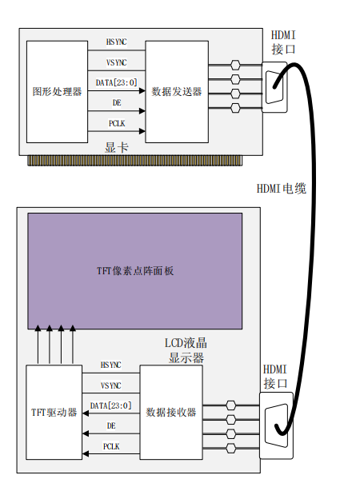
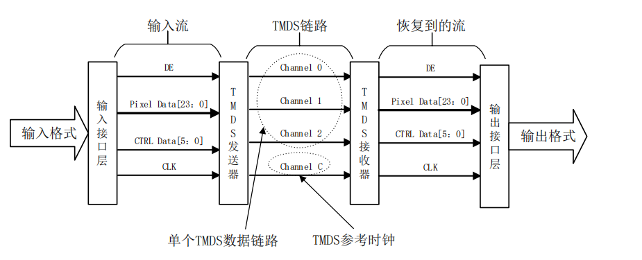
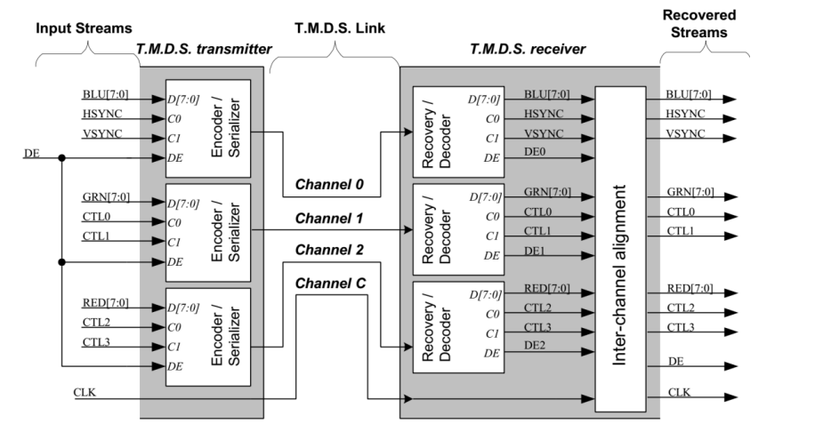
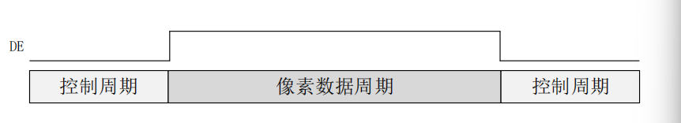
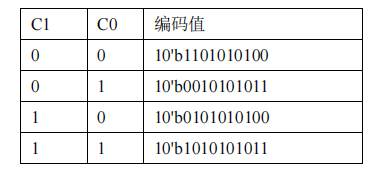

# HDMI Display

## Introduction

​    **HDMI (High-Definition Multimedia Interface)** is a fully digital video and audio transmission interface that can be used to transmit **uncompressed** audio and video signals. It can transmit audio and video signals simultaneously, so only **one HDMI cable** is needed to transmit video and audio from a source device (such as a computer, Blu-ray player, game console) to a display device (such as a TV, projector).



## Principle

​    **HDMI**'s core is to transmit data through TMDS (Transition Minimized Differential Signaling) technology. It converts video, audio, and control signals into differential signals, which are transmitted at high speed through twisted pairs.

### Circuit

​     The **essence** of implementing HDMI display on an FPGA is to send the pixel data and control signals (HSYNC, VSYNC, DE) output by the ***FPGA*** according to a specific protocol. Therefore, the following two methods have emerged:

- Hardware Method

​      Using HDMI transmitting chips, such as ADV7513, Sil9022, CH7301. These chips internally encode the pixel signals and control signals transmitted by the FPGA, and then perform serial transmission. This method is simple, but because the chip requires many pins, it leads to a waste of FPGA pin resources. The ADV7513 diagram is as follows:






- Software Method

​      Using FPGA for logic programming to implement the HDMI interface method. This method is practical, economical, and worthy of study.

A hardware circuit implementation using this method is as follows:









  **Note:** The terms hardware method and software method are summaries of the essence of different methods and belong to personal understanding. Do not copy them without authorization.

### Encoding

#### Process Overview

  HDMI uses TMDS encoding method. The transmission process includes: input interface layer, TMDS transmitter, TMDS receiver and output interface layer.



- **Input Interface Layer**: Includes 24-bit pixel data (Pixel Data), 6-bit control data (CTRK_DATA) and clock synchronization signal (CLK).
- **TMDS Transmitter**: The colors of different channels of the interface input data are separated and placed in three channels; at the same time, the reference clock is in a separate channel.
- **TMDS Receiver**: Accepts high-speed serial data on the TMDS link, decodes it, and obtains the same control signals and data as the input interface layer.
- **Output Interface Layer**: Passes the data stream and control signals decoded by the TMDS receiver to the terminal, such as an RGB LCD screen.




1. The data and control signals are divided into three groups, and each group uses a coded serial transmitter; the serial transmission clock is used for synchronous control.
2. Channel 0: Blue data component + HSYNC (horizontal sync) + VSYNC (vertical sync)
3. Channel 1: Green data component + CTL0 + CTL1 (two null signals)
4. Channel 2: Red data component + CTL2 + CTL3 (two null signals)

#### Content Overview

TMDS encodes the input **8-bit data** into **10-bit data**. Its core goal is to reduce magnetic interference by reducing the number of signal transitions (transitions of adjacent bit levels), and at the same time use differential signal transmission to improve anti-interference ability.

  In order to achieve the above objectives, there are two key steps in the encoding process:

- **Minimum Transition**: Through XOR (exclusive OR) or XNOR (exclusive NOR) operation, the encoding method with the least level encoding during transmission is selected. The lowest bit of the encoded data remains unchanged, and the remaining 7 bits are operated by XOR or XNOR on the adjacent bits of the original data. The 9th bit is used to indicate whether XOR or XNOR is used.
- **DC Balance**: Count the number of 0s and 1s after encoding, and ensure that the DC component of the signal is close to balance during long-time transmission by reversing the data polarity, avoiding signal baseline drift. The 10th bit after encoding indicates whether the encoding is flipped to ensure that the number of 0s and 1s are roughly balanced during data transmission.


#### Implementation

**1. Minimum Transition**

- First count how many 1s are in the input data
- Determine the encoding direction according to the number of 1s in the data and the lowest bit of the input data
- If the direction is 1, XOR (^) is used; otherwise, XNOR (~^) is used.


**2. DC Balance**

- According to the difference between the number of 0s and 1s in the data stream in the previous encoding process, determine the difference in this encoding process to ensure that the formats of 0s and 1s during transmission are not much different.


**3. Control Data**

- When DE is high, the encoded and transmitted data is pixel data; when DE is low, the encoded and transmitted data is control data.



The output corresponding to the control signal is shown in the following figure:



## Code

Encoding

Verilog

```verilog
`timescale 1ns / 1ps


module Encode(
    input clk,    // Pixel clock
    input rst_n,
    input [7:0] din,
    input c0,    // Control signal
    input c1,
    input de, // Data enable
    output reg [9:0] dout   // Data output
);

// Control signal corresponding to encoding
 parameter  
        CTL0  = 10'b11_01010100,
        CTL1  = 10'b00_10101011,
        CTL2  = 10'b01_01010100,
        CTL3  = 10'b10_10101011;
        

reg [3:0] n1d;  // Used to count the number of 1s in 8-bit data
reg [7:0] din_q;  // Synchronous register input 8-bit (needs one clock cycle)

// Count the number of input 0s and 1s
always @(posedge clk)begin
    din_q<=din;
    n1d<=din[0]+din[1]+din[2]+din[3]+din[4]+din[5]+din[6]+din[7];
end//always
 
// 8bit --> 9bit
wire use_Xnor;
assign use_Xnor=(n1d>4'h4)|(n1d==4'h4&&din_q[0]==1'b0);

wire [8:0]q_m;
assign q_m[0]=din_q[0];

generate
genvar i;
for (i=1;i<8;i=i+1)begin : gen_q_m
    assign q_m[i]=(use_Xnor)? ~(q_m[i-1]^din_q[i]):(q_m[i-1]^din_q[i]);
end
endgenerate
assign q_m[8]=(use_Xnor)? 1'b0:1'b1;     // Xnor direction is 0, Nor direction is 1


// 9bit --> 10bit
reg [3:0] n1q_m, n0q_m;     // Used to count 1 and 0 respectively

always @(posedge clk)begin
    n1q_m<=q_m[0]+q_m[1]+q_m[2]+q_m[3]+q_m[4]+q_m[5]+q_m[6]+q_m[7];    
    n0q_m<=4'h8-(q_m[0]+q_m[1]+q_m[2]+q_m[3]+q_m[4]+q_m[5]+q_m[6]+q_m[7]);        
end//always

reg signed  [4:0] cnt;  // 1,0 difference statistics, using the number of 1-0, the highest bit is the sign bit

wire is_equal,is_worse;
assign is_equal = (cnt==5'h0)|(n1q_m==n0q_m);    // The number of 0 and 1 is balanced
assign is_worse = (~cnt[4]&&(n1q_m>n0q_m))|(cnt[4]&&(n1q_m<n0q_m)); // Originally 1 is more than 0, now 1 is also more than 0; or originally 0 is more than 1, now 0 is also more than 1

// Pipeline alignment (2 cycles)
    reg [1:0]de_reg;
    reg [1:0]c0_reg;
    reg [1:0]c1_reg;
    reg [8:0]q_m_reg;
    
always @(posedge clk)begin
    de_reg<={de_reg[0],de};
    c0_reg<={c0_reg[0],c0};
    c1_reg<={c1_reg[0],c1};
    q_m_reg<=q_m;
end//always
// 10bit output

always @(posedge clk or negedge rst_n)begin
    if(!rst_n)begin
        dout<=0;
        cnt<=0;
    end else begin
        if(de_reg[1])begin  // Data cycle: send corresponding encoded data
            if(is_equal) begin // The number of 0 and 1 is equal, no need to flip
                dout[9]<=~q_m_reg[8];
                dout[8]<=q_m_reg[8];
                dout[7:0]<=(q_m_reg[8])?q_m_reg[7:0]:~q_m_reg[7:0];
                cnt <= (q_m_reg[8]) ? (cnt + n1q_m - n0q_m) : (cnt + n0q_m - n1q_m);
            end else if(is_worse)begin     // The number of 0 and 1 is unequal, deviating from the balanced state
                dout[9]<=1'b1;
                dout[8]<=q_m_reg[8];
                dout[7:0]<=~q_m_reg[7:0];
                cnt <= cnt + {{3{q_m_reg[8]}}, q_m_reg[8], 1'b0} + (n0q_m - n1q_m);
                
            end else begin
                dout[9]<=0;
                dout[8]<=q_m_reg[8];
                dout[7:0]<=q_m_reg[7:0];
                cnt <= cnt - {{3{~q_m_reg[8]}}, ~q_m_reg[8], 1'b0} + (n1q_m - n0q_m);
            end
        end
        else begin // Control cycle, send control signals
            cnt<=0;
            case({c1_reg[1],c0_reg[1]})
                2'b00: dout<=CTL0;
                2'b01: dout<=CTL1;
                2'b10: dout<=CTL2;
                default:dout<=CTL3;
            endcase
        end
    end//else
end//always

endmodule

 
```