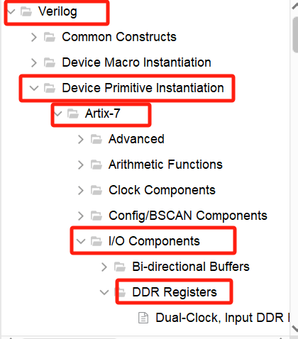

# HDMI Encoder

In [the previous blog post](https://blog.csdn.net/JInx299/article/details/145404155?spm=1001.2014.3001.5501), we introduced the HDMI encoding section. In this blog post, we will complete the subsequent task of HDMI: serial transmission of HDMI.

## ODDR

### Clock Selection

In the transmission stage, we usually use a clock frequency that is 5 times the encoder's working frequency to send the encoded 10-bit data. The reason is simple: when using DDR (Double Data Rate, where both the rising and falling edges of the clock are effective), under the ***clk_5x*** frequency, the time to serially transmit 10 bits of data is roughly the same as the time for the encoding part to process 10 bits of data under ***clk***, which is beneficial for achieving data synchronization.


### Template Usage

In FPGAs, we can use **ready-made DDR templates** to accomplish this.

Click on the Tool bar, find Language Templates.


In Verilog's Device Primitive Instantiation, find the Artixe-7 series; click on I/O Components, and find DDR Registers.



We need to serially output the encoded data, so we use ODDR (Output DDR Register); select the ODDR column, and you can see the preview of the template code on the left. Copy it as needed.


**Note:** You need to select the template library according to the series of FPGA chips you are using. Do not blindly follow the example.

### Port Introduction

The ODDR structure diagram is as follows:


The port descriptions are as follows:

| Port Signal Name | I/O  | Bit Width | Description        |
| ---------------- | ---- | --------- | ------------------ |
| C                | I    | 1         | Input Clock        |
| CE               | I    | 1         | Clock Enable       |
| D1               | I    | 1         | High Segment Input |
| D2               | I    | 1         | Low Segment Input  |
| S/R              | I    | 1         | Set/Reset          |
| Q                | O    | 1         | Output             |

Here, we explain the two working modes of ODDR: **Opposite Edge** and **Same Edge**.

In Opposite Edge mode, **input data is latched on the rising edge of the clock signal and output on the falling edge; simultaneously, the next input data is latched on the falling edge of the clock signal and output on the next rising edge**. In this mode, the output transmission delay is low, and data recovery is easier, but the power consumption is higher, and the quality requirement for the clock is also very high.


In Same Edge mode, **input data is latched simultaneously on either the rising or falling edge of the clock signal**, and output on both the rising and falling edges**. In this mode, the two edges of the output data correspond to the same input data. This method can simplify timing design and facilitate control. It has low requirements for the clock and lower power consumption, but the delay is higher.


### Correspondence between DDR Interface and TMDS Data

We use the ODDR core in FPGA to transmit TMDS data.


HDMI has a total of 4 channels, of which 3 channels are data channels and one channel is a clock channel. Each channel needs to complete 10-bit data output within 5 clock cycles. Since the output data starts from the low bit, it is necessary to switch between datain_h and datain_1 every clock cycle. The specific correspondence is as follows:


## OBUFDS

Since the TMDS encoding method uses differential transmission during transmission, that is, two signal lines are used for each channel, and their transmission levels are exactly opposite. To achieve this function, we can use the **OBUFDS** template library. The usage method is the same as ODDR, so we will not repeat it here.

## Code

### Serial Transmission Section

```verilog
`timescale 1ns / 1ps

module Ser_Def_10to1(
    input clk_x5, // 5x clock frequency
    input [9:0] datain_0, // Channel 0 data input
    input [9:0] datain_1, // Channel 1 data input
    input [9:0] datain_2, // Channel 2 data input
    input [9:0] datain_3, // Channel 3 data input

    output wire dataout_0_n, // Channel 0 differential negative output
    output wire dataout_0_p, // Channel 0 differential positive output
    output wire dataout_1_n, // Channel 1 differential negative output
    output wire dataout_1_p, // Channel 1 differential positive output
    output wire dataout_2_n, // Channel 2 differential negative output
    output wire dataout_2_p, // Channel 2 differential positive output
    output wire dataout_3_n, // Channel 3 differential negative output
    output wire dataout_3_p  // Channel 3 differential positive output
);

// modulo-5 counter, used to select data bits
reg[2:0]TMDS_CNT5=0;

// shift registers
reg[4:0]TMDS_Shift_0h=0, TMDS_Shift_01=0;
reg[4:0]TMDS_Shift_1h=0, TMDS_Shift_11=0;
reg[4:0]TMDS_Shift_2h=0, TMDS_Shift_21=0;
reg[4:0]TMDS_Shift_3h=0, TMDS_Shift_31=0;

wire [4:0] TMDS_0_1 = {datain_0[9],datain_0[7],datain_0[5],datain_0[3],datain_0[1]};
wire [4:0] TMDS_0_h = {datain_0[8],datain_0[6],datain_0[4],datain_0[2],datain_0[0]};

wire [4:0] TMDS_1_1 = {datain_1[9],datain_1[7],datain_1[5],datain_1[3],datain_1[1]};
wire [4:0] TMDS_1_h = {datain_1[8],datain_1[6],datain_1[4],datain_1[2],datain_1[0]};

wire [4:0] TMDS_2_1 = {datain_2[9],datain_2[7],datain_2[5],datain_2[3],datain_2[1]};
wire [4:0] TMDS_2_h = {datain_2[8],datain_2[6],datain_2[4],datain_2[2],datain_2[0]};

wire [4:0] TMDS_3_1 = {datain_3[9],datain_3[7],datain_3[5],datain_3[3],datain_3[1]};
wire [4:0] TMDS_3_h = {datain_3[8],datain_3[6],datain_3[4],datain_3[2],datain_3[0]};


// 5x speed to send data
always @(posedge clk_x5) begin
    // TMDS_CNT5[2] is 1 for the first time, just count to 100, which is 4, 0 to 4 -->> 5 numbers are counted
    TMDS_CNT5 <= (TMDS_CNT5[2]) ? 3'd0 : TMDS_CNT5 + 3'd1;
    TMDS_Shift_0h <= (TMDS_CNT5[2]) ? TMDS_0_h : TMDS_Shift_0h[4:1];
    TMDS_Shift_01 <= (TMDS_CNT5[2]) ? TMDS_0_1 : TMDS_Shift_01[4:1];
    TMDS_Shift_1h <= (TMDS_CNT5[2]) ? TMDS_1_h : TMDS_Shift_1h[4:1];
    TMDS_Shift_11 <= (TMDS_CNT5[2]) ? TMDS_1_1 : TMDS_Shift_11[4:1];
    TMDS_Shift_2h <= (TMDS_CNT5[2]) ? TMDS_2_h : TMDS_Shift_2h[4:1];
    TMDS_Shift_21 <= (TMDS_CNT5[2]) ? TMDS_2_1 : TMDS_Shift_21[4:1];
    TMDS_Shift_3h <= (TMDS_CNT5[2]) ? TMDS_3_h : TMDS_Shift_3h[4:1];
    TMDS_Shift_31 <= (TMDS_CNT5[2]) ? TMDS_3_1 : TMDS_Shift_31[4:1];
end


wire dataout_0, data_out1, data_out2, dataout_3;


// Use ODDR and OBUFDS
// Channel 0
ODDR #(
    .DDR_CLK_EDGE("OPPOSITE_EDGE"), // "OPPOSITE_EDGE" or "SAME_EDGE"
    .INIT(1'b0),                     // Initial value of Q: 1'b0 or 1'b1
    .SRTYPE("SYNC")                    // Set/Reset type: "SYNC" or "ASYNC"
) ODDR_0 (
    .Q(dataout_0),        // 1-bit DDR output
    .C(clk_x5),          // 1-bit clock input
    .CE(1'b1),         // 1-bit clock enable input
    .D1(TMDS_Shift_01[0]), // 1-bit data input (positive edge)
    .D2(TMDS_Shift_0h[0]), // 1-bit data input (negative edge)
    .R(1'b0),          // 1-bit reset
    .S(1'b0)           // 1-bit set
);

OBUFDS #(
    .IOSTANDARD("DEFAULT"), // Specify the output I/O standard
    .SLEW("SLOW")         // Specify the output slew rate
) OBUFDS_0 (
    .O(dataout_0_p),  // Diff_p output (connect directly to top-level port)
    .OB(dataout_0_n), // Diff_n output (connect directly to top-level port)
    .I(dataout_0)     // Buffer input
);

// Channel 1
ODDR #(
    .DDR_CLK_EDGE("OPPOSITE_EDGE"), // "OPPOSITE_EDGE" or "SAME_EDGE"
    .INIT(1'b0),                     // Initial value of Q: 1'b0 or 1'b1
    .SRTYPE("SYNC")                    // Set/Reset type: "SYNC" or "ASYNC"
) ODDR_1 (
    .Q(dataout_1),        // 1-bit DDR output
    .C(clk_x5),          // 1-bit clock input
    .CE(1'b1),         // 1-bit clock enable input
    .D1(TMDS_Shift_11[0]), // 1-bit data input (positive edge)
    .D2(TMDS_Shift_1h[0]), // 1-bit data input (negative edge)
    .R(1'b0),          // 1-bit reset
    .S(1'b0)           // 1-bit set
);

OBUFDS #(
    .IOSTANDARD("DEFAULT"), // Specify the output I/O standard
    .SLEW("SLOW")         // Specify the output slew rate
) OBUFDS_1 (
    .O(dataout_1_p),  // Diff_p output (connect directly to top-level port)
    .OB(dataout_1_n), // Diff_n output (connect directly to top-level port)
    .I(dataout_1)     // Buffer input
);


// Channel 2
ODDR #(
    .DDR_CLK_EDGE("OPPOSITE_EDGE"), // "OPPOSITE_EDGE" or "SAME_EDGE"
    .INIT(1'b0),                     // Initial value of Q: 1'b0 or 1'b1
    .SRTYPE("SYNC")                    // Set/Reset type: "SYNC" or "ASYNC"
) ODDR_2 (
    .Q(dataout_2),        // 1-bit DDR output
    .C(clk_x5),          // 1-bit clock input
    .CE(1'b1),         // 1-bit clock enable input
    .D1(TMDS_Shift_21[0]), // 1-bit data input (positive edge)
    .D2(TMDS_Shift_2h[0]), // 1-bit data input (negative edge)
    .R(1'b0),          // 1-bit reset
    .S(1'b0)           // 1-bit set
);

OBUFDS #(
    .IOSTANDARD("DEFAULT"), // Specify the output I/O standard
    .SLEW("SLOW")         // Specify the output slew rate
) OBUFDS_2 (
    .O(dataout_2_p),  // Diff_p output (connect directly to top-level port)
    .OB(dataout_2_n), // Diff_n output (connect directly to top-level port)
    .I(dataout_2)     // Buffer input
);

// Channel 3
ODDR #(
    .DDR_CLK_EDGE("OPPOSITE_EDGE"), // "OPPOSITE_EDGE" or "SAME_EDGE"
    .INIT(1'b0),                     // Initial value of Q: 1'b0 or 1'b1
    .SRTYPE("SYNC")                    // Set/Reset type: "SYNC" or "ASYNC"
) ODDR_3 (
    .Q(dataout_3),        // 1-bit DDR output
    .C(clk_x5),          // 1-bit clock input
    .CE(1'b1),         // 1-bit clock enable input
    .D1(TMDS_Shift_31[0]), // 1-bit data input (positive edge)
    .D2(TMDS_Shift_3h[0]), // 1-bit data input (negative edge)
    .R(1'b0),          // 1-bit reset
    .S(1'b0)           // 1-bit set
);

OBUFDS #(
    .IOSTANDARD("DEFAULT"), // Specify the output I/O standard
    .SLEW("SLOW")         // Specify the output slew rate
) OBUFDS_3 (
    .O(dataout_3_p),  // Diff_p output (connect directly to top-level port)
    .OB(dataout_3_n), // Diff_n output (connect directly to top-level port)
    .I(dataout_3)     // Buffer input
);

endmodule
```

### HDMI Transmitter

As long as the encoder is instantiated and linked with image data stream data and control signals according to the HDMI protocol, the transmitter module can be implemented.


When TMDS sends data, it also sends the pixel clock (which we记为 tmds_clk) together. tmds_clk should be consistent with the pixel clock pixelclk frequency, not pixelclk_x5. tmds_clk is used to synchronize a complete encoded data, not a single data bit.

There are two ways to generate tmds_clk: one is to invert pixelclk; the other is to use ODDR to generate it in the form of data. We use ODDR to generate it in the form of data. This method can maintain the phase relationship between the output clock and the output data to a certain extent, which is convenient for the receiving end to synchronize. The method of generating the waveform is very simple: we assign 10'b11111_00000 to the input segment of ODDR, so that in the first 2.5 clock cycles, the output level is high, and in the latter 2.5 cycles, the output level is low.

```verilog
`timescale 1ns / 1ps

module HDMI_Encoder(
    // Input global control signals
    input pixelclk,     // Pixel clock
    input pixelclk_x5,   // 5x pixel clock
    input rst_p,        // Reset, positive polarity

    // Input display data
    input [7:0]blue_din,  // Blue data input
    input [7:0]green_din, // Green data input
    input [7:0]red_din,   // Red data input

    // Input display control signals
    input hsync,        // Horizontal sync
    input vsync,        // Vertical sync
    input de,           // Data enable

    // Output
    output tdms_clk_p,   // TMDS clock positive output
    output tdms_clk_n,   // TMDS clock negative output
    output [2:0] tmds_data_p, // TMDS data positive output
    output [2:0] tmds_data_n  // TMDS data negative output
);

wire [9:0]red;
wire [9:0]green;
wire [9:0]blue;

// Instantiate modules
Encode encb(
    .clk(pixelclk),     // Pixel clock
    .rst_n(~rst_p),    // Reset, negative polarity
    .din(blue_din),    // Data input, blue
    .c0(hsync),       // Control signal c0, horizontal sync
    .c1(vsync),       // Control signal c1, vertical sync
    .de(de),          // Data enable
    .dout(blue)       // Data output, blue
);

Encode encg(
    .clk(pixelclk),     // Pixel clock
    .rst_n(~rst_p),    // Reset, negative polarity
    .din(green_din),   // Data input, green
    .c0(1'b0),         // Control signal c0, constant 0
    .c1(1'b0),         // Control signal c1, constant 0
    .de(de),          // Data enable
    .dout(green)      // Data output, green
);

Encode encr(
    .clk(pixelclk),     // Pixel clock
    .rst_n(~rst_p),    // Reset, negative polarity
    .din(red_din),     // Data input, red
    .c0(1'b0),         // Control signal c0, constant 0
    .c1(1'b0),         // Control signal c1, constant 0
    .de(de),          // Data enable
    .dout(red)        // Data output, red
);

Ser_Def_10to1 HDMI_Sender(
    .clk_x5(pixelclk_x5),     // 5x pixel clock
    .datain_0(blue),        // Data input channel 0, blue
    .datain_1(green),       // Data input channel 1, green
    .datain_2(red),         // Data input channel 2, red
    .datain_3(10'b11111_00000), // Data input channel 3, for clock generation
    .dataout_0_n(tmds_data_p[0]), // Data output channel 0 negative, positive polarity
    .dataout_0_p(tmds_data_n[0]), // Data output channel 0 positive, negative polarity
    .dataout_1_n(tmds_data_p[1]), // Data output channel 1 negative, positive polarity
    .dataout_1_p(tmds_data_n[1]), // Data output channel 1 positive, negative polarity
    .dataout_2_n(tmds_data_p[2]), // Data output channel 2 negative, positive polarity
    .dataout_2_p(tmds_data_n[2]), // Data output channel 2 positive, negative polarity
    .dataout_3_n(tmds_clk_n),    // Clock output negative, negative polarity
    .dataout_3_p(tmds_clk_p)     // Clock output positive, positive polarity
);

endmodule
```

Note: The Encode module code can be found in my [previous article](https://blog.csdn.net/JInx299/article/details/145404155?spm=1001.2014.3001.5501)

After completing this controller, when using it, you only need to connect the corresponding signals to the HDMI_Encoder corresponding ports based on the VGA or TFT display system.

### Top Level

```verilog
`timescale 1ns / 1ps

module HDMI_Disp(
    input clk_50M,       // 50MHz system clock
    input rst_n,         // Reset, negative polarity

    // HDMI1 interface
    output hdmi1_clk_p,   // HDMI1 clock positive output
    output hdmi1_clk_n,   // HDMI1 clock negative output
    output [2:0]hdmi1_dat_p, // HDMI1 data positive output
    output [2:0]hdmi1_data_n, // HDMI1 data negative output
    output [2:0]hdmi1_oe,   // HDMI1 output enable

    // HDMI2 interface
    output hdmi2_clk_p,   // HDMI2 clock positive output
    output hdmi2_clk_n,   // HDMI2 clock negative output
    output [2:0]hdmi2_dat_p, // HDMI2 data positive output
    output [2:0]hdmi2_data_n, // HDMI2 data negative output
    output [2:0]hdmi2_oe,   // HDMI2 output enable

    // HDMI3 interface
    output hdmi3_clk_p,   // HDMI3 clock positive output
    output hdmi3_clk_n,   // HDMI3 clock negative output
    output [2:0]hdmi3_dat_p, // HDMI3 data positive output
    output [2:0]hdmi3_data_n, // HDMI3 data negative output
    output [2:0]hdmi3_oe,   // HDMI3 output enable

    // TFT interface
    output [15:0]TFT_rgb, // TFT RGB data output
    output TFT_hs,       // TFT horizontal sync
    output TFT_vs,       // TFT vertical sync
    output TFT_clk,      // TFT clock
    output TFT_de,       // TFT data enable
    output TFT_pwn       // TFT PWM
);

// Resolution_800x480 // Clock is 33MHz
parameter
    Disp_Width = 800,
    Disp_Height = 480;

wire pixelclk;      // Pixel clock, 33MHz
wire pixelclk_x5;    // 5x pixel clock, 165MHz
wire pll_locked;    // PLL locked signal

wire rst_p;         // Reset, positive polarity
wire [11:0] disp_h_addr; // Display horizontal address
wire [11:0] disp_v_addr; // Display vertical address
wire disp_data_req;  // Display data request
wire [23:0]disp_data;   // Display data, 24 bits RGB
wire disp_hs;        // Display horizontal sync
wire disp_vs;        // Display vertical sync
wire [7:0]disp_red;    // Display red data
wire [7:0]disp_green;  // Display green data
wire [7:0]disp_blue;   // Display blue data
wire disp_de;        // Display data enable
wire disp_pclk;      // Display pixel clock

assign rst_p = ~pll_locked;


pll pll (
    .clk_out1(pixelclk),   // output 33M
    .clk_out2(pixelclk_x5),  // output 165M
    .resetn(rst_n),      // input resetn
    .locked(pll_locked),   // output locked
    .clk_in1(clk_50M)    // input clk_in1
);

Color_Bar #(
    .Disp_Width(Disp_Width),
    .Disp_Height(Disp_Height)
) color_bar (
    .disp_h_addr(disp_h_addr),
    .disp_v_addr(disp_v_addr),
    .disp_data_req(disp_data_req),
    .disp_data(disp_data)
);

Disp_Driver disp_driver (
    .clk_disp (pixelclk),
    .rst_p (rst_p),
    .Data_In (disp_data),
    .DataReq (disp_data_req),
    .H_Addr (disp_h_addr),
    .V_Addr (disp_v_addr),
    .Disp_Hs (disp_hs),
    .Disp_Vs (disp_vs),
    .Disp_Red (disp_red),
    .Disp_Green (disp_green),
    .Disp_Blue (disp_blue),
    .Frame_Begin (),       // Flag for the beginning of a frame
    .Disp_De (disp_de),
    .Disp_Pclk (disp_pclk)
);

// TFT
assign TFT_rgb = {disp_red[7:3], disp_green[7:2], disp_blue[7:3]};
assign TFT_hs = disp_hs;
assign TFT_vs = disp_vs;
assign TFT_clk = disp_pclk;
assign TFT_de = disp_de;
assign TFT_pwm = 1'b1;

HDMI_Encoder encoder1 (
    // Input global control signals
    .pixelclk (pixelclk),
    .pixelclk_x5 (pixelclk_x5),
    .rst_p (rst_p),
    .blue_din (disp_blue),
    .green_din (disp_green),
    .red_din (disp_red),
    .hsync (disp_hs),
    .vsync (disp_vs),
    .de (disp_de),
    .tdms_clk_p (hdmi1_clk_p),
    .tdms_clk_n (hdmi1_clk_n),
    .tmds_data_p (hdmi1_dat_p),
    .tmds_data_n (hdmi1_data_n)
);

assign hdmi1_oe = 1'b1;

HDMI_Encoder encoder2 (
    // Input global control signals
    .pixelclk (pixelclk),
    .pixelclk_x5 (pixelclk_x5),
    .rst_p (rst_p),
    .blue_din (disp_blue),
    .green_din (disp_green),
    .red_din (disp_red),
    .hsync (disp_hs),
    .vsync (disp_vs),
    .de (disp_de),
    .tdms_clk_p (hdmi2_clk_p),
    .tdms_clk_n (hdmi2_clk_n),
    .tmds_data_p (hdmi2_dat_p),
    .tmds_data_n (hdmi2_data_n)
);

assign hdmi2_oe = 1'b1;


endmodule
```


### Auxiliary Modules

Color_Bar

```verilog
`timescale 1ns / 1ps

module Color_Bar #(
    parameter Disp_Width = 800,
    parameter Disp_Height = 480
)(
    input [11:0]disp_h_addr,   // Display horizontal address input
    input [11:0]disp_v_addr,   // Display vertical address input
    input disp_data_req,     // Display data request input
    output reg [23:0] disp_data // Display data output
);

localparam
    BLACK    = 24'h000000, // Black color
    BLUE     = 24'h0000FF, // Blue color
    RED      = 24'hFF0000, // Red color
    PURPPLE  = 24'hFF00FF, // Purple color
    GREEN    = 24'h00FF00, // Green color
    CYAN     = 24'h00FFFF, // Cyan color
    YELLOW   = 24'hFFFF00, // Yellow color
    WHITE    = 24'hFFFFFF; // White color

// Define the default display color value for each pixel block
localparam
    R0_C0 = BLACK,    // Pixel block in row 0, column 0
    R0_C1 = BLUE,     // Pixel block in row 0, column 1
    R1_C0 = RED,      // Pixel block in row 1, column 0
    R1_C1 = PURPPLE,  // Pixel block in row 1, column 1
    R2_C0 = GREEN,    // Pixel block in row 2, column 0
    R2_C1 = CYAN,     // Pixel block in row 2, column 1
    R3_C0 = YELLOW,   // Pixel block in row 3, column 0
    R3_C1 = WHITE;    // Pixel block in row 3, column 1

wire [3:0]row_act;   // Active row flags
wire [1:0]col_act;   // Active column flags

genvar i, j;
localparam row_height = Disp_Height / 4, // Height of each row block
           col_width  = Disp_Width / 2;  // Width of each column block
for (i = 0; i < 4; i = i + 1) begin
    assign row_act[i] = (disp_v_addr >= i * row_height) && (disp_v_addr < (1 + i) * row_height);
end
for (j = 0; j < 2; j = j + 1) begin
    assign col_act[j] = (disp_h_addr >= j * col_width) && (disp_h_addr < (1 + j) * col_width);
end

always @(*)
    case ({row_act, col_act, disp_data_req})
        7'b0001_01_1: disp_data = R0_C0;
        7'b0001_10_1: disp_data = R0_C1;
        7'b0010_01_1: disp_data = R1_C0;
        7'b0010_10_1: disp_data = R1_C1;
        7'b0100_01_1: disp_data = R2_C0;
        7'b0100_10_1: disp_data = R2_C1;
        7'b1000_01_1: disp_data = R3_C0;
        7'b1000_10_1: disp_data = R3_C1;
        default:      disp_data = R0_C0;
    endcase

endmodule
```


### Header File

disp_para.vh

```verilog
/* Usage instructions
When using, select 2 predefined parameters according to actual work needs.

Parameter 1: MODE_RGBxxx
Predefined to determine whether the driver works in 16-bit mode or 24-bit mode, choose one of the two
MODE_RGB888: 24-bit mode
MODE_RGB565: 16-bit mode
4.3-inch TFT display ------ use 16-bit color RGB565 mode
5-inch TFT display -------- use 16-bit color RGB565 mode
GM7123 module ---------- use 24-bit color RGB888 mode

Parameter 2: Resolution_xxxx
Predefined to determine the resolution of the display device, common device resolutions are as follows

4.3-inch TFT display:
Resolution_480x272

5-inch TFT display:
Resolution_800x480

VGA common resolution:
Resolution_640x480
Resolution_800x600
Resolution_1024x600
Resolution_1024x768
Resolution_1280x720
Resolution_1920x1080
*/

// You can also set the display device type through macro definition. Enable one and shield others with comments.
// Use 4.3-inch 480*272 resolution display
//`define HW_TFT43

// Use 5-inch 800*480 resolution display
`define HW_TFT50

// Use VGA monitor, default is 640*480 resolution, 24-bit mode. Other resolutions or 16-bit mode can be reconfigured from line 63 to line 75 in the code.
//`define HW_VGA

//=====================================
// The following macro definitions are used to set the bit mode and resolution parameters according to the display device
//=====================================
`ifdef HW_TFT43 // Use 4.3-inch 480*272 resolution display
    `define MODE_RGB565
    `define Resolution_480x272 1 // Clock is 9MHz

`elsif HW_TFT50 // Use 5-inch 800*480 resolution display
    `define MODE_RGB565
    `define Resolution_800x480 1 // Clock is 33MHz

`elsif HW_VGA // Use VGA monitor, default is 640*480 resolution, 24-bit mode
    //=====================================
    // Other resolutions and 16-bit modes can be selected. Users need to set them according to actual needs.
    // Code lines 75~76 set the bit mode
    // Code lines 77~83 set the resolution
    //=====================================
    //`define MODE_RGB565
    `define MODE_RGB888
    //`define Resolution_640x480 1 // Clock is 25.175MHz
    //`define Resolution_800x480 1 // Clock is 33MHz, compatible with TFT5.0
    //`define Resolution_800x600 1 // Clock is 40MHz
    //`define Resolution_1024x600 1 // Clock is 51MHz
    //`define Resolution_1024x768 1 // Clock is 65MHz
    `define Resolution_1280x720 1 // Clock is 74.25MHz
    //`define Resolution_1920x1080 1 // Clock is 148.5MHz
`endif

//=====================================
// For non-special needs, users do not need to modify the following content
//=====================================
// Define different color depths
`ifdef MODE_RGB888
    `define Red_Bits 8
    `define Green_Bits 8
    `define Blue_Bits 8

`elsif MODE_RGB565
    `define Red_Bits 5
    `define Green_Bits 6
    `define Blue_Bits 5
`endif

// Define timing parameters for different resolutions
`ifdef Resolution_480x272
    `define H_Total_Time 12'd525
    `define H_Right_Border 12'd0
    `define H_Front_Porch 12'd2
    `define H_Sync_Time 12'd41
    `define H_Back_Porch 12'd2
    `define H_Left_Border 12'd0

    `define V_Total_Time 12'd286
    `define V_Bottom_Border 12'd0
    `define V_Front_Porch 12'd2
    `define V_Sync_Time 12'd10
    `define V_Back_Porch 12'd2
    `define V_Top_Border 12'd0

`elsif Resolution_640x480
    `define H_Total_Time 12'd800
    `define H_Right_Border 12'd8
    `define H_Front_Porch 12'd8
    `define H_Sync_Time 12'd96
    `define H_Back_Porch 12'd40
    `define H_Left_Border 12'd8

    `define V_Total_Time 12'd525
    `define V_Bottom_Border 12'd8
    `define V_Front_Porch 12'd2
    `define V_Sync_Time 12'd2
    `define V_Back_Porch 12'd25
    `define V_Top_Border 12'd8

`elsif Resolution_800x480
    `define H_Total_Time 12'd1056
    `define H_Right_Border 12'd0
    `define H_Front_Porch 12'd40
    `define H_Sync_Time 12'd128
    `define H_Back_Porch 12'd88
    `define H_Left_Border 12'd0

    `define V_Total_Time 12'd525
    `define V_Bottom_Border 12'd8
    `define V_Front_Porch 12'd2
    `define V_Sync_Time 12'd2
    `define V_Back_Porch 12'd25
    `define V_Top_Border 12'd8

`elsif Resolution_800x600
    `define H_Total_Time 12'd1056
    `define H_Right_Border 12'd0
    `define H_Front_Porch 12'd40
    `define H_Sync_Time 12'd128
    `define H_Back_Porch 12'd88
    `define H_Left_Border 12'd0

    `define V_Total_Time 12'd628
    `define V_Bottom_Border 12'd0
    `define V_Front_Porch 12'd1
    `define V_Sync_Time 12'd4
    `define V_Back_Porch 12'd23
    `define V_Top_Border 12'd0

`elsif Resolution_1024x600
    `define H_Total_Time 12'd1344
    `define H_Right_Border 12'd0
    `define H_Front_Porch 12'd24
    `define H_Sync_Time 12'd136
    `define H_Back_Porch 12'd160
    `define H_Left_Border 12'd0

    `define V_Total_Time 12'd628
    `define V_Bottom_Border 12'd0
    `define V_Front_Porch 12'd1
    `define V_Sync_Time 12'd4
    `define V_Back_Porch 12'd23
    `define V_Top_Border 12'd0

`elsif Resolution_1024x768
    `define H_Total_Time 12'd1344
    `define H_Right_Border 12'd0
    `define H_Front_Porch 12'd24
    `define H_Sync_Time 12'd136
    `define H_Back_Porch 12'd160
    `define H_Left_Border 12'd0

    `define V_Total_Time 12'd806
    `define V_Bottom_Border 12'd0
    `define V_Front_Porch 12'd3
    `define V_Sync_Time 12'd6
    `define V_Back_Porch 12'd29
    `define V_Top_Border 12'd0

`elsif Resolution_1280x720
    `define H_Total_Time 12'd1650
    `define H_Right_Border 12'd0
    `define H_Front_Porch 12'd110
    `define H_Sync_Time 12'd40
    `define H_Back_Porch 12'd220
    `define H_Left_Border 12'd0

    `define V_Total_Time 12'd750
    `define V_Bottom_Border 12'd0
    `define V_Front_Porch 12'd5
    `define V_Sync_Time 12'd5
    `define V_Back_Porch 12'd20
    `define V_Top_Border 12'd0


`elsif Resolution_1920x1080
    `define H_Total_Time 12'd2200
    `define H_Right_Border 12'd0
    `define H_Front_Porch 12'd88
    `define H_Sync_Time 12'd44
    `define H_Back_Porch 12'd148
    `define H_Left_Border 12'd0

    `define V_Total_Time 12'd1125
    `define V_Bottom_Border 12'd0
    `define V_Front_Porch 12'd4
    `define V_Sync_Time 12'd5
    `define V_Back_Porch 12'd36
    `define V_Top_Border 12'd0

`endif
```

