# Displaying images on a TFT screen using a ROM IP core

In a [previous blog post](https://blog.csdn.net/JInx299/article/details/145385973?spm=1001.2014.3001.5501), we learned how to display color bars on a TFT screen. In this post, we will take it a step further and learn how to display any image on the TFT screen. We will learn how to use a ROM IP core, write the corresponding module, and finally display the target image.

[Click here](https://github.com/ZZhiHao196/Verilog_For_Starter) to get the complete files of the code provided in this post.

## Calling the ROM IP Core

To display an image, we need to convert the two-dimensional image into one-dimensional data and store it in ROM in a specific format. During operation, the TFT display reads data from the ROM core.

### **Image Format Conversion**

​     Here we use an image conversion tool. [Click here](https://www.google.com/search?q=https://pan.baidu.com/s/1bStLZ12EhgnsREoUVv051w%3Fpwd%3D9jk4&authuser=3) to get the software directly. The **extraction code** is 9jk4. Once you have the software, we can begin.

   1. Find the image you want to display and convert it to a BMP bitmap. 

​              The image I will display here is as follows:


​     You may not know how to convert JPG, PNG, or other image formats to BMP format. Here I will share my method, hoping it will be helpful to you.

a.  Open the system's built-in Paint software and import the target image.

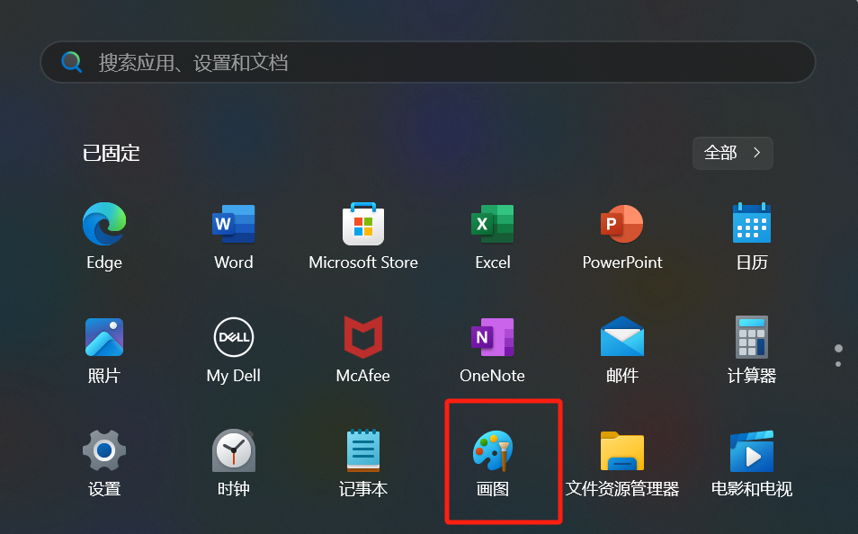

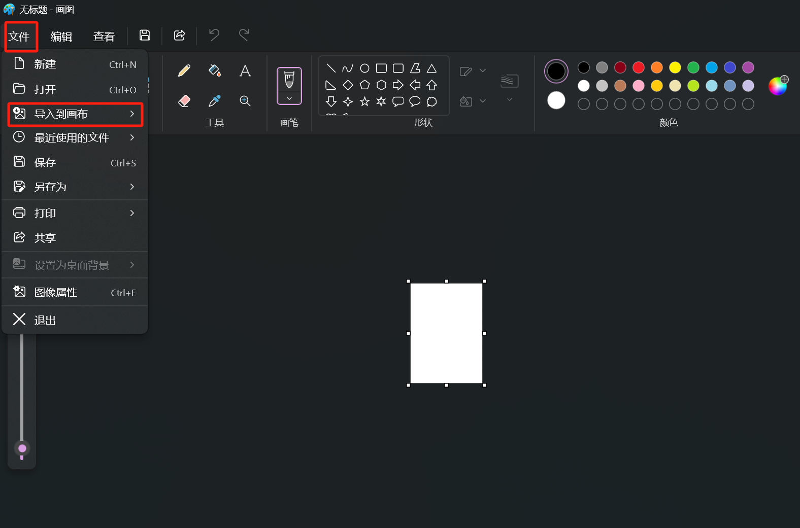

b.  Process the image to ensure the size is appropriate.


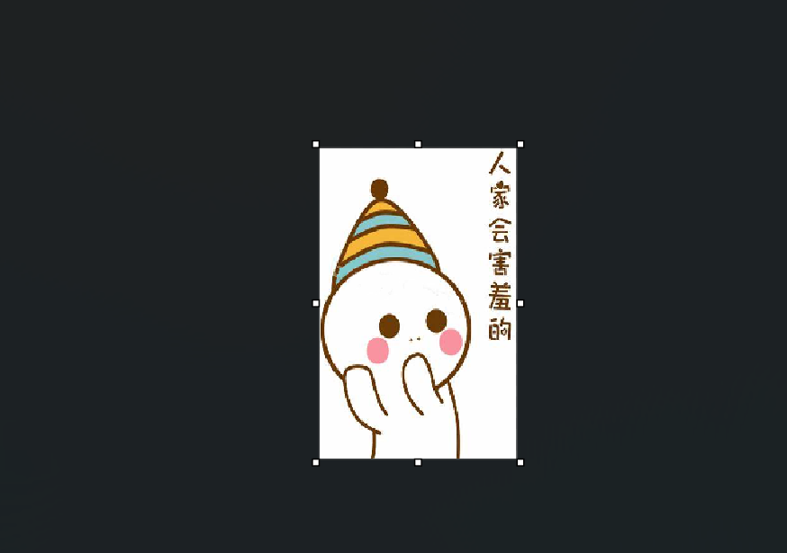

c.  Export the image.


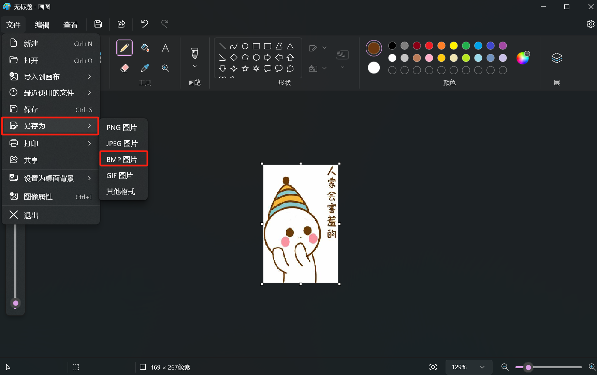

Now that the image format issue is resolved, let's move on to the second step.

2. **Get the .coe file**

Open the software tool, load the image file, select the specific format (RGB565), and convert it.

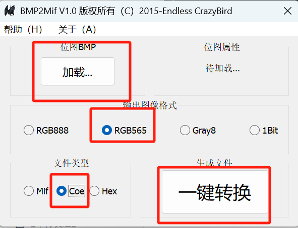

   I want to make a few points here:

- **RGB565**: This is because our TFT display uses the RGB565 format.
- **Coe**: The ROM IP core reads data, which is generally loaded with a .coe file.

3. **Loading complete**


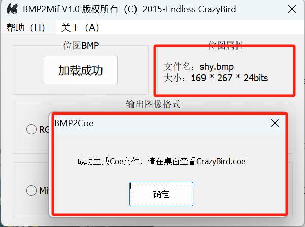

Note down the size of the image: `169*267`, as this will be needed later when configuring the ROM. Also, consider copying and pasting the generated file into the Vivado file path.

### Configuring the ROM IP Core

Now let's configure the ROM IP.

1. Click the **Window** tab, find **IP Catalog**, search for **ROM**, find it, and double-click it.

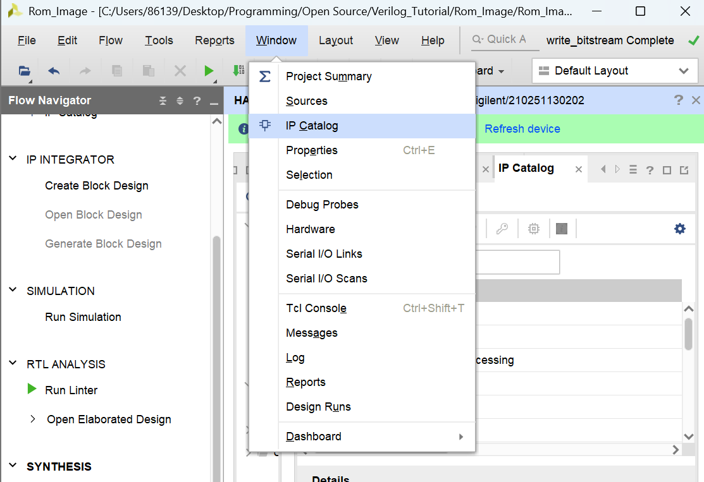

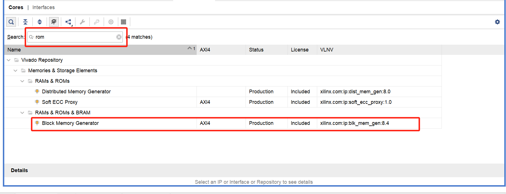

2. Select Single Port ROM.


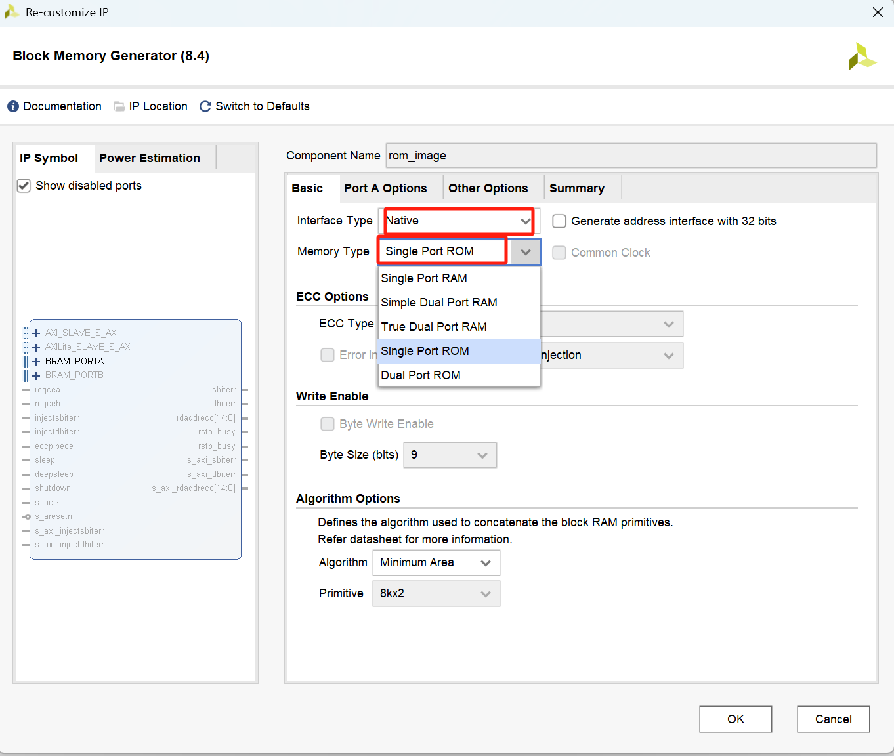

3. Configure the Option page.


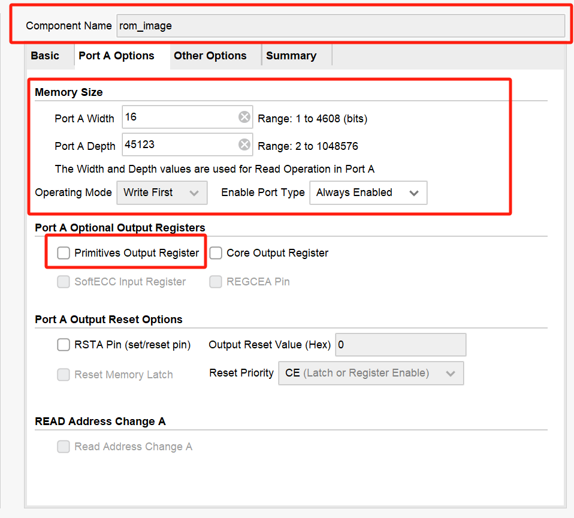

- **Width**: Represents the number of bits of stored data. For RGB565, it is 16 bits.
- **Depth**: Represents the number of stored data, corresponding to the size of the image. In this case, 169 * 267 = 45123.

We choose **Always Enable** so that we can always read data from the ROM. Note: In actual project engineering, it is best to use an enable signal for control. Here, for the sake of simplicity, we choose to always enable it.

Do not check **Primitives Output Register**: If checked, the data will be two clock cycles slower than the enable signal. If not checked, the data lags by one clock cycle.

4. Load the data file.


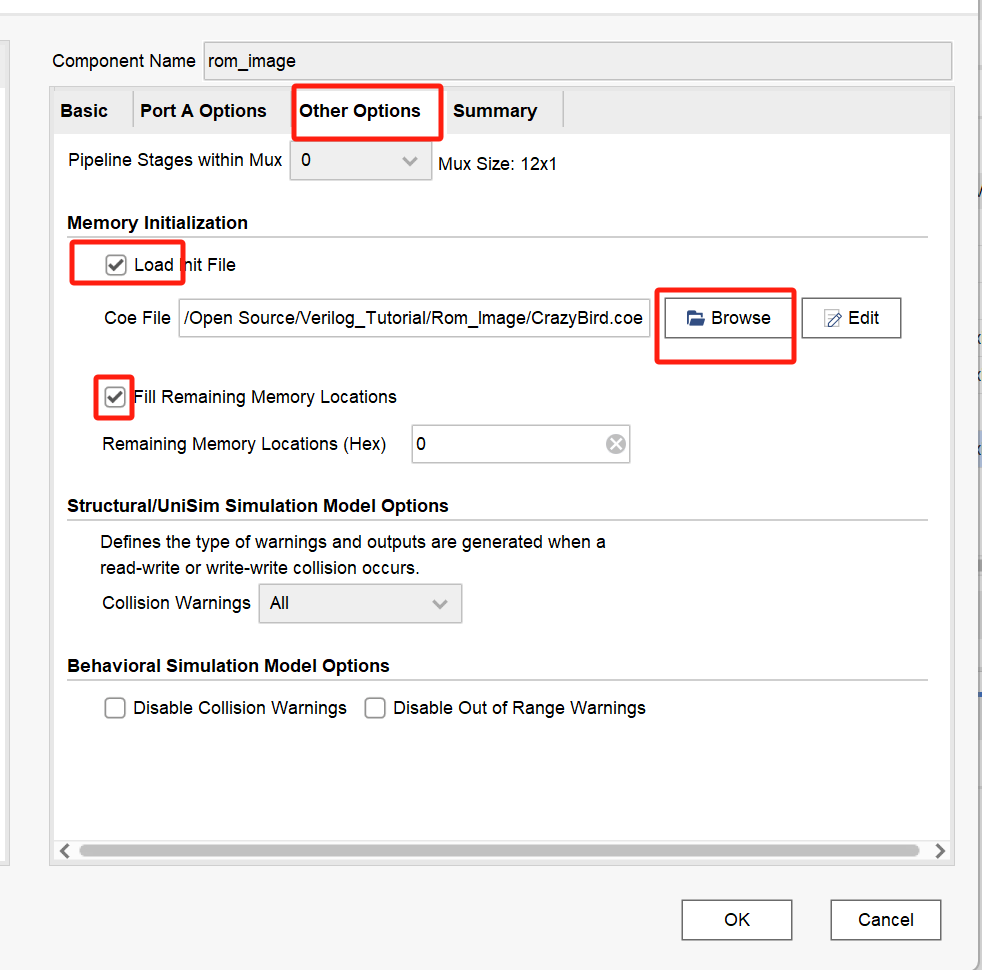

If the Depth configured earlier is less than the number of data in the file, an error will be reported, as shown below:


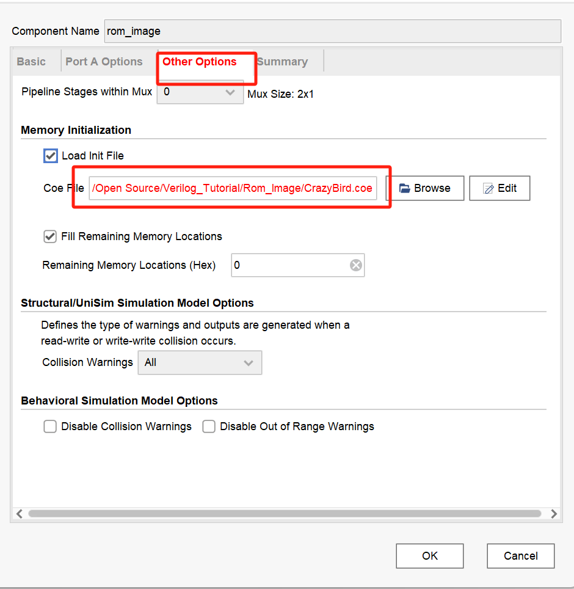


5. After ensuring everything is correct, click the OK button, and then click the Generate button.


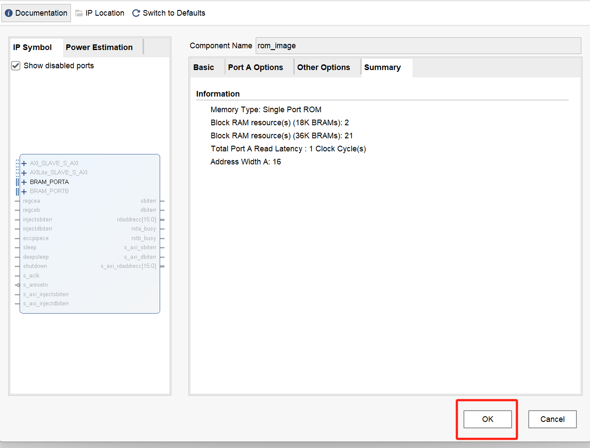


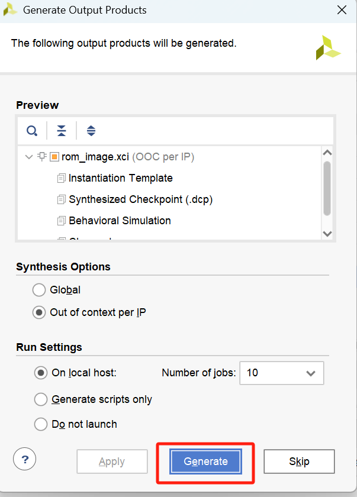


## Image_Extract Module

▌Module Definition and Parameters Section

```verilog
module Image_Extract
# (
  parameter H_Visible_area = 800, // Screen visible area width (pixels)
  parameter V_Visible_area = 480, // Screen visible area height (pixels)
  parameter IMG_WIDTH = 169,      // Original image width
  parameter IMG_HEIGHT = 267,     // Original image height
  parameter IMG_DATA_WIDTH = 16,  // Pixel data width (RGB565 format)
  parameter ROM_ADDR_WIDTH = 16   // Image ROM address bus width
)
```

- The first two parameters describe the physical resolution of the screen.
- The middle three parameters describe the characteristics of the stored original image.
- The last two parameters define the bit width of the data bus and storage address.


▌Input and Output Port Definitions

```verilog
(
  input clk_ctrl,                // TFT control clock (synchronized with the screen refresh rate)
  input reset_n,                 // Low-level reset signal
  input [15:0] img_disp_hbegin,  // Image display starting X coordinate
  input [15:0] img_disp_vbegin,  // Image display starting Y coordinate
  input [IMG_DATA_WIDTH - 1:0] disp_back_color,  // Background color (RGB value)
  input frame_begin,             // Frame synchronization signal (pulse at the beginning of each frame)
  input disp_data_req,           // Data request signal (valid display area flag)
  input [11:0] visible_hcount,   // Current horizontal scan position
  input [11:0] visible_vcount,   // Current vertical scan position
  input [IMG_DATA_WIDTH - 1:0] rom_data,  // Pixel data read from ROM
  output reg [ROM_ADDR_WIDTH - 1:0] rom_addra,  // ROM read address
  output [IMG_DATA_WIDTH - 1:0] disp_data     // Final output pixel data
);
```

- Input signals are strictly synchronized with the TFT controller timing.
- Use `visible_hcount` / `visible_vcount` for screen coordinate positioning.
- `disp_back_color` is used for background filling in non-image areas.


▌ Boundary Detection Logic

```verilog
// Detect if the image exceeds the screen boundary
assign h_exceed = img_disp_hbegin + IMG_WIDTH > H_Visible_area - 1;
assign v_exceed = img_disp_vbegin + IMG_HEIGHT > V_Visible_area - 1;
```

- Calculate the theoretical right boundary of the image (X start + image width).

- Compare whether it exceeds the maximum screen coordinates (`H_Visible_area` - 1).

- Handle the vertical boundary in the same way.


▌ Display Area Determination Logic

```verilog
// Generate a valid display area signal
assign img_h_disp = h_exceed ?
                    (visible_hcount >= img_disp_hbegin && visible_hcount < H_Visible_area) :
                    (visible_hcount >= img_disp_hbegin && visible_hcount < img_disp_hbegin + IMG_WIDTH);

assign img_v_disp = v_exceed ?
                    (visible_vcount >= img_disp_vbegin && visible_vcount < V_Visible_area) :
                    (visible_vcount >= img_disp_vbegin && visible_vcount < img_disp_vbegin + IMG_HEIGHT);

assign img_disp = disp_data_req && img_h_disp && img_v_disp;
```

- When the image exceeds the screen, automatically limit the valid area to within the screen.

1. Normal mode(h_exceed= 0)

   - Effective condition: The picture is completely within the horizontal range of the screen.
   - Valid area: `[img_disp_hbegin, img_disp_hbegin + IMG_WIDTH)`
   - Example:
     - Screen width 800
     - Set starting coordinate = 100, image width = 200
     - Valid X range: 100 ≤ X < 300

2. Truncation mode( h_exceed= 1)

   - Effective condition: The right side of the image exceeds the screen.
   - Valid area: `[img_disp_hbegin, H_Visible_area)`
   - Example:
     - Screen width 800
     - Set starting coordinate = 700, image width = 200
     - Valid X range: 700 ≤ X < 800 (actually only displays the 100 pixels on the right)
     
     

- The combined `img_disp` signal indicates that the current scan position needs to display image content.


▌ ROM Address Generation Logic

```verilog
always @(posedge clk_ctrl or negedge reset_n) begin
  if (!reset_n)
    rom_addra <= 'd0;
  else if (frame_begin)
    rom_addra <= 'd0;
  else if (img_disp) begin
    if (visible_hcount == hcount_max)
      rom_addra <= rom_addra + (img_disp_hbegin + IMG_WIDTH - hcount_max);
    else
      rom_addra <= rom_addra + 1'b1;
  end
end
```

1. Reset the address to zero at reset or new frame start.

2. Increment the address pixel by pixel in the valid image area.

3. Special boundary handling: When scanning to the end of the line, calculate the address offset.

- Normal situation: `hcount_max` = `img_disp_hbegin` + `IMG_WIDTH` - 1
- Out-of-bounds situation: `hcount_max` = `H_Visible_area` - 1
- Offset = Original planned next line starting address - Actually reachable address


▌ Data Output Logic

```verilog
assign disp_data = img_disp ? rom_data : disp_back_color;
```

Output selection strategy:

- Output the pixel data read from ROM in the image display area.
- Display the background color in non-image areas.
- Achieve real-time mixing of the image layer and the background layer.


▌Complete Code

```verilog
module Image_Extract
# (
  parameter H_Visible_area = 800,   // Width of the entire screen display area
  parameter V_Visible_area = 480,   // Height of the entire screen display area
  parameter IMG_WIDTH = 169,        // Image width
  parameter IMG_HEIGHT = 267,       // Image height
  parameter IMG_DATA_WIDTH = 16,    // Image pixel width
  parameter ROM_ADDR_WIDTH = 16     // Storage image ROM address width
)
(
  input clk_ctrl,                          // Input clock, consistent with the TFT screen clock
  input reset_n,                           // Reset signal, active low

  input [15:0] img_disp_hbegin,            // Row coordinate of the first pixel in the upper left corner of the image to be displayed on the TFT screen
  input [15:0] img_disp_vbegin,            // Field coordinate of the first pixel in the upper left corner of the image to be displayed on the TFT screen
  input [IMG_DATA_WIDTH - 1:0] disp_back_color,  // Background color
  input frame_begin,                       // Flag signal for the start of a frame image, clk_ctrl clock domain
  input disp_data_req,                     // Data valid area
  input [11:0] visible_hcount,             // TFT visible area row scan counter
  input [11:0] visible_vcount,             // TFT visible area field scan counter
  input [IMG_DATA_WIDTH - 1:0] rom_data,    // Read image data
  output reg [ROM_ADDR_WIDTH - 1:0] rom_addra,  // ROM address for reading image data
  output [IMG_DATA_WIDTH - 1:0] disp_data      // Data displayed on the TFT screen
);

  wire h_exceed;
  wire v_exceed;
  wire img_h_disp;
  wire img_v_disp;
  wire img_disp;
  wire [15:0] hcount_max;

  // Determine if the image will exceed the screen range, resulting in incomplete display
  assign h_exceed = img_disp_hbegin + IMG_WIDTH > H_Visible_area - 1'b1;
  assign v_exceed = img_disp_vbegin + IMG_HEIGHT > V_Visible_area - 1'b1;

  assign img_h_disp = h_exceed ? (visible_hcount >= img_disp_hbegin && visible_hcount < H_Visible_area) :
                               (visible_hcount >= img_disp_hbegin && visible_hcount < img_disp_hbegin + IMG_WIDTH);

  assign img_v_disp = v_exceed ? (visible_vcount >= img_disp_vbegin && visible_vcount < V_Visible_area) :
                               (visible_vcount >= img_disp_vbegin && visible_vcount < img_disp_vbegin + IMG_HEIGHT);

  assign img_disp = disp_data_req && img_h_disp && img_v_disp;

  assign hcount_max = h_exceed ? (H_Visible_area - 1'b1) : (img_disp_hbegin + IMG_WIDTH - 1'b1);

  always @(posedge clk_ctrl or negedge reset_n) begin
    if (!reset_n)
      rom_addra <= 'd0;
    else if (frame_begin)
      rom_addra <= 'd0;
    else if (img_disp) begin
      if (visible_hcount == hcount_max)
        rom_addra <= rom_addra + (img_disp_hbegin + IMG_WIDTH - hcount_max);
      else
        rom_addra <= rom_addra + 1'b1;
    end else
      rom_addra <= rom_addra;
  end

  assign disp_data = img_disp ? rom_data : disp_back_color;

endmodule
```

## Top Level Module


### **Header File**

**disp_param.vh**

```verilog
`define HW_TFT50

// Use VGA monitor, default is 640*480 resolution, 24-bit mode, other resolutions or 16-bit mode can be reconfigured in code lines 63 to 75
//`define HW_VGA

//=====================================
// The following macro definitions are used to set the bit mode and resolution based on the display device
//=====================================
`ifdef HW_TFT43  // Use 4.3 inch 480*272 resolution display
  `define MODE_RGB565
  `define Resolution_480x272 1 // Clock is 9MHz

`elsif HW_TFT50  // Use 5 inch 800*480 resolution display
  `define MODE_RGB565
  `define Resolution_800x480 1 // Clock is 33MHz

`elsif HW_VGA    // Use VGA monitor, default is 640*480 resolution, 24-bit mode
//=====================================
// You can choose other resolutions and 16-bit mode, users need to set according to actual needs
// The three lines and four lines below set the bit mode
// The continuous macro definition part after the five lines below sets the resolution
//=====================================
  `define MODE_RGB565
 // `define MODE_RGB888
  `define Resolution_640x480   1 // Clock is 25.175MHz
  //`define Resolution_800x600   1 // Clock is 40MHz
  //`define Resolution_1024x600  1 // Clock is 51MHz
  //`define Resolution_1024x768  1 // Clock is 65MHz
  //`define Resolution_1280x720  1 // Clock is 74.25MHz
  //`define Resolution_1920x1080 1 // Clock is 148.5MHz
`endif

//=====================================
// For non-special needs, users do not need to modify the following content
//=====================================
// Define different color depths
`ifdef MODE_RGB888
  `define Red_Bits   8
  `define Green_Bits 8
  `define Blue_Bits  8
  
`elsif MODE_RGB565
  `define Red_Bits   5
  `define Green_Bits 6
  `define Blue_Bits  5
`endif

// Define timing parameters for different resolutions
`ifdef Resolution_480x272
  `define H_Total_Time    12'd525
  `define H_Right_Border  12'd0
  `define H_Front_Porch   12'd2
  `define H_Sync_Time     12'd41
  `define H_Back_Porch    12'd2
  `define H_Left_Border   12'd0

  `define V_Total_Time    12'd286
  `define V_Bottom_Border 12'd0
  `define V_Front_Porch   12'd2
  `define V_Sync_Time     12'd10
  `define V_Back_Porch    12'd2
  `define V_Top_Border    12'd0
  
`elsif Resolution_640x480
  `define H_Total_Time    12'd800
  `define H_Right_Border  12'd8
  `define H_Front_Porch   12'd8
  `define H_Sync_Time     12'd96
  `define H_Back_Porch    12'd40
  `define H_Left_Border   12'd8

  `define V_Total_Time    12'd525
  `define V_Bottom_Border 12'd8
  `define V_Front_Porch   12'd2
  `define V_Sync_Time     12'd2
  `define V_Back_Porch    12'd25
  `define V_Top_Border    12'd8

`elsif Resolution_800x480
  `define H_Total_Time    12'd1056
  `define H_Right_Border  12'd0
  `define H_Front_Porch   12'd40
  `define H_Sync_Time     12'd128
  `define H_Back_Porch    12'd88
  `define H_Left_Border   12'd0

  `define V_Total_Time    12'd525
  `define V_Bottom_Border 12'd8
  `define V_Front_Porch   12'd2
  `define V_Sync_Time     12'd2
  `define V_Back_Porch    12'd25
  `define V_Top_Border    12'd8

`elsif Resolution_800x600
  `define H_Total_Time    12'd1056
  `define H_Right_Border  12'd0
  `define H_Front_Porch   12'd40
  `define H_Sync_Time     12'd128
  `define H_Back_Porch    12'd88
  `define H_Left_Border   12'd0

  `define V_Total_Time    12'd628
  `define V_Bottom_Border 12'd0
  `define V_Front_Porch   12'd1
  `define V_Sync_Time     12'd4
  `define V_Back_Porch    12'd23
  `define V_Top_Border    12'd0

`elsif Resolution_1024x600
  `define H_Total_Time    12'd1344
  `define H_Right_Border  12'd0
  `define H_Front_Porch   12'd24
  `define H_Sync_Time     12'd136
  `define H_Back_Porch    12'd160
  `define H_Left_Border   12'd0

  `define V_Total_Time    12'd628
  `define V_Bottom_Border 12'd0
  `define V_Front_Porch   12'd1
  `define V_Sync_Time     12'd4
  `define V_Back_Porch    12'd23
  `define V_Top_Border    12'd0

`elsif Resolution_1024x768
  `define H_Total_Time    12'd1344
  `define H_Right_Border  12'd0
  `define H_Front_Porch   12'd24
  `define H_Sync_Time     12'd136
  `define H_Back_Porch    12'd160
  `define H_Left_Border   12'd0

  `define V_Total_Time    12'd806
  `define V_Bottom_Border 12'd0
  `define V_Front_Porch   12'd3
  `define V_Sync_Time     12'd6
  `define V_Back_Porch    12'd29
  `define V_Top_Border    12'd0

`elsif Resolution_1280x720
  `define H_Total_Time    12'd1650
  `define H_Right_Border  12'd0
  `define H_Front_Porch   12'd110
  `define H_Sync_Time     12'd40
  `define H_Back_Porch    12'd220
  `define H_Left_Border   12'd0

  `define V_Total_Time    12'd750
  `define V_Bottom_Border 12'd0
  `define V_Front_Porch   12'd5
  `define V_Sync_Time     12'd5
  `define V_Back_Porch    12'd20
  `define V_Top_Border    12'd0
  
`elsif Resolution_1920x1080
  `define H_Total_Time    12'd2200
  `define H_Right_Border  12'd0
  `define H_Front_Porch   12'd88
  `define H_Sync_Time     12'd44
  `define H_Back_Porch    12'd148
  `define H_Left_Border   12'd0

  `define V_Total_Time    12'd1125
  `define V_Bottom_Border 12'd0
  `define V_Front_Porch   12'd4
  `define V_Sync_Time     12'd5
  `define V_Back_Porch    12'd36
  `define V_Top_Border    12'd0

`endif
```


### Top-Level Instantiation

**Rom_Image_Tft.v**

```verilog
module Rom_Image_Tft (

  input clk50M,   // System clock input 50M
  input reset_n,  // Reset signal input, active low

  output [15:0] TFT_rgb,  // TFT data output
  output TFT_hs,         // TFT horizontal synchronization signal
  output TFT_vs,         // TFT vertical synchronization signal
  output TFT_clk,        // TFT pixel clock
  output TFT_de,         // TFT data enable
  output TFT_pwm         // TFT backlight control
);

  // Set the size of the image to be displayed, the address width of the ROM storing the image, and the background color of the display
  parameter DISP_IMAGE_W = 169;
  parameter DISP_IMAGE_H = 267;
  parameter ROM_ADDR_WIDTH = 16;     // Determined by the depth of the ROM bearing the image storage
  parameter DISP_BACK_COLOR = 16'hFFFF;  // White

  parameter TFT_WIDTH = 800;
  parameter TFT_HEIGHT = 480;

  // The image is displayed in the middle of the screen
  parameter DISP_HBEGIN = (TFT_WIDTH - DISP_IMAGE_W) / 2;
  parameter DISP_VBEGIN = (TFT_HEIGHT - DISP_IMAGE_H) / 2;

  wire pll_locked;
  wire clk_ctrl;
  wire tft_reset_n;
  wire [ROM_ADDR_WIDTH - 1:0] rom_addra;
  wire [15:0] disp_data;
  wire [15:0] rom_data;
  wire disp_data_req;
  wire [11:0] visible_hcount;
  wire [11:0] visible_vcount;
  wire frame_begin;
  wire tft_reset_p;
  wire [4:0] Disp_red;
  wire [5:0] Disp_green;
  wire [4:0] Disp_blue;
  wire clk33M;
  wire clk165M;

  assign tft_reset_n = pll_locked;
  assign tft_reset_p = ~pll_locked;
  assign clk_ctrl = clk33M;

  pll pll (
    // Clock out ports
    .clk_out1(clk33M),      // output clk_out1
    .clk_out2(clk165M),     // output clk_out2
    // Status and control signals
    .resetn(reset_n),     // input reset, active low
    .locked(pll_locked),  // output locked
    // Clock in ports
    .clk_in1(clk50M)       // input clk_in1
  );

  rom_image rom_image (
    .clka(clk_ctrl),    // input wire clka
    .addra(rom_addra),  // input wire [16 : 0] addra
    .douta(rom_data)    // output wire [15 : 0] douta
  );

  Image_Extract
  #(
    .H_Visible_area(TFT_WIDTH),       // Screen display area width
    .V_Visible_area(TFT_HEIGHT),      // Screen display area height
    .IMG_WIDTH(DISP_IMAGE_W),        // Image width
    .IMG_HEIGHT(DISP_IMAGE_H),       // Image height
    .IMG_DATA_WIDTH(16),              // Image pixel width
    .ROM_ADDR_WIDTH(ROM_ADDR_WIDTH)  // Address width of the ROM storing the image
  )
  image_extract (
    .clk_ctrl(clk_ctrl),
    .reset_n(tft_reset_n),
    .img_disp_hbegin(DISP_HBEGIN),
    .img_disp_vbegin(DISP_VBEGIN),
    .disp_back_color(DISP_BACK_COLOR),
    .rom_addra(rom_addra),
    .rom_data(rom_data),
    .frame_begin(frame_begin),
    .disp_data_req(disp_data_req),
    .visible_hcount(visible_hcount),
    .visible_vcount(visible_vcount),
    .disp_data(disp_data)
  );

  Disp_Driver disp_driver (
    .clk_disp(clk_ctrl),
    .rst_p(tft_reset_p),

    .Data_In(disp_data),
    .DataReq(disp_data_req),

    .H_Addr(visible_hcount),
    .V_Addr(visible_vcount),

    .Disp_Hs(TFT_hs),
    .Disp_Vs(TFT_vs),
    .Disp_Red(Disp_red),
    .Disp_Green(Disp_green),
    .Disp_Blue(Disp_blue),
    .Frame_Begin(frame_begin),  // Flag signal for the start of a frame image
    .Disp_De(TFT_de),
    .Disp_Pclk(TFT_clk)
  );

  assign TFT_rgb = {Disp_red, Disp_green, Disp_blue};
  assign TFT_pwm = 1'b1;

endmodule
```


### TFT Display 

**Disp_Driver.v**

```verilog
`include "disp_param.vh"

module Disp_Driver (
  input clk_disp,
  input rst_p,

  input [`Red_Bits + `Green_Bits + `Blue_Bits - 1:0] Data_In,
  output DataReq,

  output [11:0] H_Addr,
  output [11:0] V_Addr,

  output reg Disp_Hs,
  output reg Disp_Vs,
  output reg [`Red_Bits - 1:0] Disp_Red,
  output reg [`Green_Bits - 1:0] Disp_Green,
  output reg [`Blue_Bits - 1:0] Disp_Blue,
  output reg Frame_Begin,  // Flag signal for the start of a frame image
  output reg Disp_De,
  output Disp_Pclk
);

  // Internal signals
  wire hcount_ov;  // Row counter overflow signal
  wire vcount_ov;  // Column counter overflow signal

  reg [11:0] hcount_r;  // Row counter register
  reg [11:0] vcount_r;  // Column counter register

  `ifdef HW_VGA
    assign Disp_Pclk = ~clk_disp;
  `else
    assign Disp_Pclk = clk_disp;
  `endif

  assign DataReq = Disp_De;

  // Timing parameters
  parameter Hdata_Begin = `H_Sync_Time + `H_Back_Porch + `H_Left_Border - 1'b1,
            Hdata_End = `H_Total_Time - `H_Right_Border - `H_Front_Porch - 1'b1,
            Vdata_Begin = `V_Sync_Time + `V_Back_Porch + `V_Top_Border - 1'b1,
            Vdata_End = `V_Total_Time - `V_Bottom_Border - `V_Front_Porch - 1'b1,
            VGA_HS_End = `H_Sync_Time - 1'b1,
            VGA_VS_End = `V_Sync_Time - 1'b1,
            Hpixel_End = `H_Total_Time - 1'b1,
            Vline_End = `V_Total_Time - 1'b1;

  // Row counter overflow signal
  assign hcount_ov = (hcount_r >= Hpixel_End);  // Row counter reaches maximum value, overflow signal is valid

  // Row counter
  always @(posedge clk_disp or posedge rst_p) begin
    if (rst_p)            // Reset, row counter cleared
      hcount_r <= 0;
    else if (hcount_ov)   // Reaches the end of the row scan, row counter cleared
      hcount_r <= 0;
    else                  // Otherwise, row counter increments by 1
      hcount_r <= hcount_r + 1;
  end

  // Column counter overflow signal
  assign vcount_ov = (vcount_r >= Vline_End);  // Column counter reaches maximum value and row counter overflows, overflow signal is valid

  // Column counter
  always @(posedge clk_disp or posedge rst_p) begin
    if (rst_p)          // Reset, column counter cleared
      vcount_r <= 0;
    else if (hcount_ov) begin  // Row counter overflows, column counter increments
      if (vcount_ov)    // Reaches the end of the column scan, column counter cleared
        vcount_r <= 0;
      else              // Otherwise, column counter increments by 1
        vcount_r <= vcount_r + 1;
    end
    else
      vcount_r <= vcount_r;
  end

  // Data valid area flag
  always @(posedge clk_disp) begin
    Disp_De <= ((hcount_r >= Hdata_Begin) && (hcount_r < Hdata_End)) &&
               ((vcount_r >= Vdata_Begin) && (vcount_r < Vdata_End));  // When both row and column counters are in the valid data area, the data valid area flag is valid
  end

  assign H_Addr = Disp_De ? (hcount_r - Hdata_Begin) : 12'd0;
  assign V_Addr = Disp_De ? (vcount_r - Vdata_Begin) : 12'd0;

  always @(posedge clk_disp) begin
    Disp_Hs <= (hcount_r >= VGA_HS_End);  // Row counter greater than or equal to VGS_HS_End, horizontal sync signal is valid
    Disp_Vs <= (vcount_r >= VGA_VS_End);  // Column counter greater than or equal to VGS_VS_End, vertical sync signal is valid
    {Disp_Red, Disp_Green, Disp_Blue} <= (Disp_De) ? Data_In : 0;  // Output RGB data
  end
    
    // in the valid data area, otherwise output black
  end

  // Extract rising edge of Disp_Vs
  reg Disp_Vs_Dly1;
  always @(posedge clk_disp) begin
    Disp_Vs_Dly1 <= Disp_Vs;
  end

  always @(posedge clk_disp or posedge rst_p) begin
    if (rst_p) begin
      Frame_Begin <= 0;
    end else if (!Disp_Vs_Dly1 && Disp_Vs) begin
      Frame_Begin <= 1;
    end else begin
      Frame_Begin <= 0;
    end
  end

endmodule
```


## Result Display

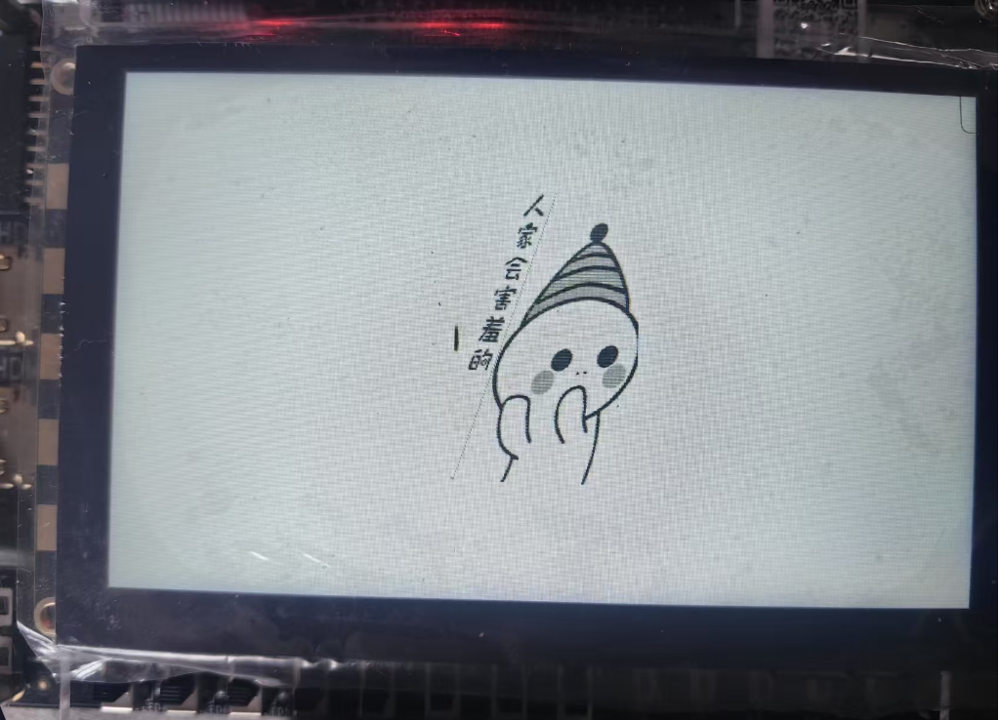
